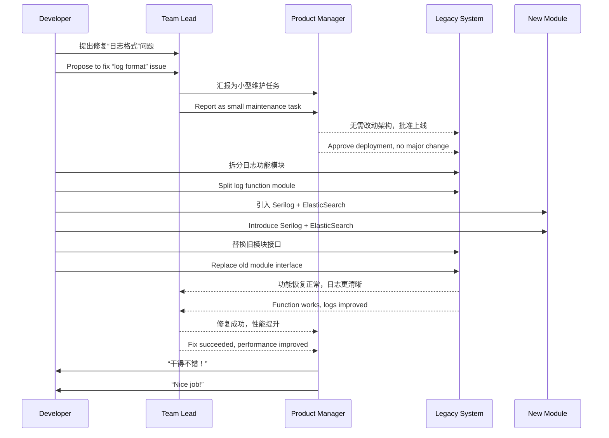

# 第一计：瞒天过海 

Stratagem 01: Deceive the Sky to Cross the Ocean

---

### 古文原意

Original Meaning

> 运筹帷幄，不露声色，在敌人最警觉之时出奇不意，以熟悉之术掩盖真实意图，悄然达成目的。
> When the enemy is most alert, act in a way so familiar that it arouses no suspicion. Use routine actions to disguise your true intention and achieve your goal unnoticed.

---

### 程序员解读

Programmer's Interpretation

在团队或系统中，用看似平常的操作、熟悉的流程，悄然实现架构变更或重大优化，避免引起管理层或用户的过度干预或质疑。
In your team or system, use seemingly routine actions and familiar workflows to quietly implement architectural changes or major optimizations, avoiding excessive attention or interference from management or users.

例如：你想替换性能瓶颈模块、引入新架构或第三方系统，但担心引起项目震荡。
For example, you want to replace a performance bottleneck module, or introduce a new architecture or third-party system, but worry it might trigger project disruption.

此时就需要“瞒天过海”之术——以“补丁升级”“bug 修复”为名，悄悄完成目标。
This is where the stratagem comes in—under the guise of a “patch update” or “bug fix,” you quietly complete your true objective.

---

### 实用场景

Practical Scenarios

场景一：技术债优化
Scenario 1: Refactoring Technical Debt

你要重构一个老旧的认证模块，但业务线极度依赖且排斥停机维护。
You need to refactor an old authentication module, but the business line heavily depends on it and resists downtime.

你采用“修复登录 bug”的名义，悄悄引入 OAuth2 模块替代原本的自定义认证方式。
You proceed under the label of “fixing login bugs,” while quietly replacing the legacy authentication with an OAuth2 module.

场景二：架构升级
Scenario 2: Architecture Upgrade

团队希望从单体应用迁移到微服务架构。
The team plans to migrate from a monolith to microservices architecture.

你在一次“日志服务拆分”中，先将日志模块独立出去，逐步试探，再扩展其他子服务，悄然完成跨海部署。
During a so-called “log refactor,” you separate the logging module first, then gradually extend it into separate services, thus completing the transformation under the radar.

---

### 示例代码（C#）

Example Code (C#)

```csharp
// 假装是修复日志格式，其实是引入分布式日志系统
// Pretending to fix log format, but actually introducing distributed logging

public class LegacyLogger
{
    public void Log(string message)
    {
        // 原本写入本地日志文件
        // Previously writing to local file
        // File.AppendAllText("log.txt", message);

        // 实际上引入了 ElasticSearch + Serilog
        // Actually switched to ElasticSearch + Serilog
        var logger = new LoggerConfiguration()
            .WriteTo.Elasticsearch(new ElasticsearchSinkOptions(new Uri("http://localhost:9200")))
            .CreateLogger();

        logger.Information(message);
    }
}
```

---

### Mermaid 时序图：系统改造过程的“瞒天过海”流程图

Mermaid Diagram: Stealthy System Refactoring ("Deceive the Sky")



---

### 格言

Maxim

> 表象如常，心机暗涌；不动声色，渡海而行。
> Let your surface remain still, but your mind sail beyond the horizon.
