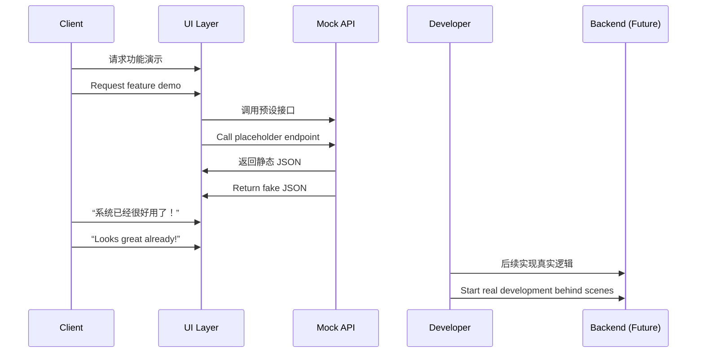

[Back to 目录（Index）](https://github.com/uwspstar/The-36-Stratagems-for-Programmers/blob/main/Index.md)

# 第七计：无中生有

Stratagem 07: Create Something from Nothing

---

### 古文原意

Original Meaning

> 虚虚实实，化无为有，借假为真，迷惑敌人。
> Turn illusion into reality. Use what seems imaginary to produce tangible results, and mislead the enemy with fabricated signals.

---

### 程序员解读

Programmer's Interpretation

通过构建“虚拟接口”“伪数据”“测试模块”或“假服务”来制造稳定、成熟、可用的假象，为后续开发赢得时间、空间和话语权。
Build mock interfaces, fake data, or test modules to create the illusion of a complete system, buying time and flexibility to develop the real thing later.

例如，在需求未定或资源不足时，先通过前端原型 + 假数据 API 展示效果，获取支持后再逐步完善后台逻辑。
For example, when requirements are unclear or resources limited, use a front-end prototype with fake APIs to demo the product, gain approval, and then build the actual backend later.

---

### 实用场景

Practical Scenarios

场景一：先演示后开发
Scenario 1: Demo First, Develop Later

客户催促要看到“成果”，你先用前端页面 + Mock.js 构建数据假象，赢得时间再开发后端。
The client demands visible progress. You use a front-end page with Mock.js to simulate data, delivering a fake but functional demo while backend work continues.

场景二：先设接口占位置
Scenario 2: Define Contracts Before Implementation

为了推动跨组协作，你先设计并上线 API Swagger 文档，让对方以为系统准备就绪。实际逻辑则在后续迭代中逐步填补。
To drive cross-team work, you publish API Swagger docs early to show readiness. Actual implementation is filled in over time.

---

### 示例代码（C#）

Example Code (C#)

```csharp
// 无中生有：接口存在，实际尚未实现
// Create illusion of working system with stubs

[ApiController]
[Route("api/[controller]")]
public class OrdersController : ControllerBase
{
    [HttpGet("{id}")]
    public IActionResult GetOrder(int id)
    {
        // 返回模拟数据，实际数据尚未实现
        return Ok(new {
            Id = id,
            Status = "PENDING",
            CreatedAt = DateTime.UtcNow,
            Items = new[] { "Sample Item A", "Sample Item B" }
        });
    }
}
```

---

### Mermaid 流程图：假象先行，真相随后

Mermaid Diagram: The Illusion Comes First, Reality Follows



---

### 格言

Maxim

> 明为虚设，实则筹谋；先造幻影，后取真功。
> Build illusions on the surface, but scheme beneath; project shadows first, and earn substance later.
