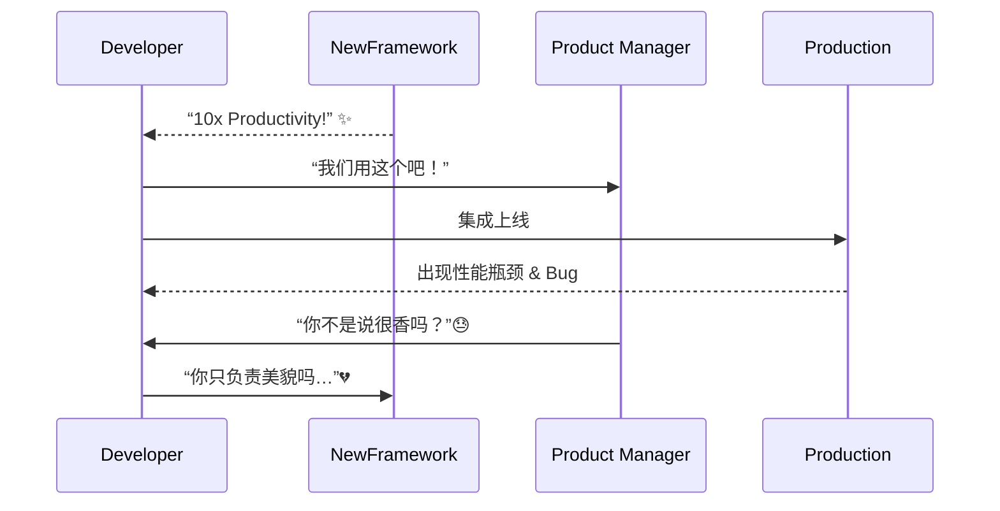

[Back to 目录（Index）](https://github.com/uwspstar/The-36-Stratagems-for-Programmers/blob/main/Index.md)

# 第三十一计：美人计

Stratagem 31: Use a Beauty Trap

---

### 古文原意

Original Meaning

> 以色相、情感或引诱为手段，使对方失去判断，露出破绽。
> Use allure, emotion, or attraction to cloud judgment—leading the target into vulnerability.

---

### 程序员解读

Programmer's Interpretation
程序世界的“美人计”不一定是人，更可能是**UI 的精美包装**、**功能的表面便利性**，或者是“看起来很香”的第三方库/新技术。
In software, the “beauty” often lies in elegant UI, seductive APIs, or buzzworthy frameworks that lure teams into poor long-term decisions.

例如：一个新框架宣传“十倍开发效率”，实际隐藏大量坑；或某人以漂亮原型掩盖架构不稳定。
For instance: a flashy framework promises “10x speed,” but brings long-term debt; or a sleek prototype masks brittle architecture underneath.

---

### 实用场景

场景一：识破技术“美人计”
Scenario 1: See Through a Tech Beauty Trap

某开源项目在 GitHub 上明星众多，文档精美，你引入后才发现依赖不稳定、维护停滞。
A library has many GitHub stars and beautiful docs. After adoption, you realize it’s poorly maintained and unstable.

场景二：UI 优先掩盖业务逻辑缺陷
Scenario 2: UI Masks Logic Flaws

某团队展示的新系统 UI 极具吸引力，但数据一致性和 API 安全性却漏洞百出。
A team shows off a dazzling new UI—but its backend is insecure and lacks data integrity.

---

### 示例代码（C#）

Example Code (C#)

```csharp
// 美人计：漂亮 API 背后的隐藏代价
// Flashy API, hidden performance trap

public class CacheWrapper
{
    // 表面很优雅的调用方式
    public string Get(string key) => File.ReadAllText($"/tmp/cache/{key}");

    // 实际是阻塞 IO + 缺少缓存更新策略
    // 长期会拖慢系统性能
}
```

---

### Mermaid 流程图：貌美藏刺，诱敌自伤

Mermaid Diagram: Beauty Lures, Pitfalls Follow



---

### 格言

Maxim

> 美丽常掩陷阱，包装难掩本质；艳而不实，终伤其主。
> Beauty often hides the trap; dazzling form, if hollow, brings ruin in the end.
