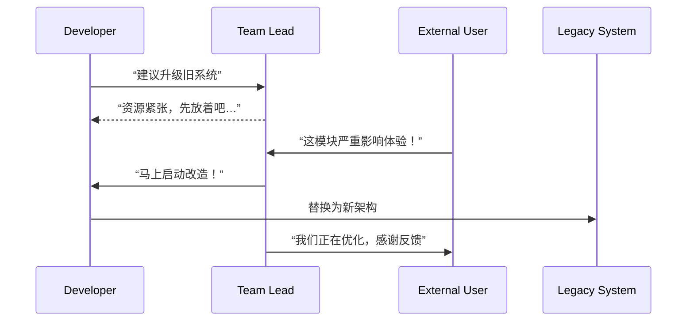

# 第三十三计：反间计

Stratagem 33: Let the Enemy's Spies Sow Discord

---

### 古文原意

Original Meaning

> 利用对方的“内鬼”反向传递信息，离间其阵营，破其内部信任。
> Use the enemy’s spies against them—sow discord within their ranks through misinformation or manipulation.

---

### 程序员解读

Programmer's Interpretation
在技术团队中，“反间计”不等于搞人，而是利用**外部推手、对手观点或竞争需求**，促使内部思考和改革。例如，用“友军建议”推动技术债还款，或借竞争对手上线压力说服团队改进流程。
In tech, this stratagem isn't about betrayal, but about using **external voices** (like clients, rivals, auditors) to instigate **internal improvement**—especially when internal push fails.

---

### 实用场景

场景一：借客户反馈推动技术升级
Scenario 1: Use Clients to Justify Refactor

你早就建议替换脆弱组件未果，直到客户反复抱怨其 Bug，领导才支持改造。
You’ve long advocated for replacing a fragile module. Only after customer complaints mount does leadership approve it.

场景二：借竞品上线倒逼团队加速
Scenario 2: Use Rival Progress to Speed Up

你引用竞品最近上线的热门功能，引导团队意识到落后压力，从而推动原本迟缓的开发任务。
You cite a competitor’s hot release—sparking urgency in your team to catch up on a stalled feature.

---

### 示例代码（C#）

Example Code (C#)

```csharp
// 反间计：通过外部反馈促进内部技术更新
// Let external pain become internal gain

public class LegacyService
{
    public string GetLegacyData()
    {
        // 原本多次建议替换此接口
        // 后因客户批评“响应太慢”终于被改造
        return SlowOldDependency.Fetch();
    }
}
```

---

### Mermaid 流程图：借外施力，内变其形

Mermaid Diagram: External Push → Internal Shift



---

### 格言

Maxim

> 外患之言，借力内用；非我军中，反助我谋。
> From outsiders comes truth; use their voice to spark reform within.
