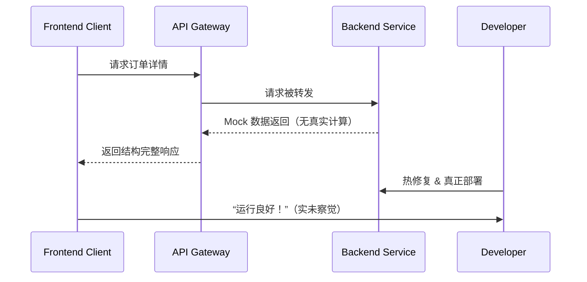

# 第三十二计：空城计

Stratagem 32: Use an Empty City Stratagem

---

### 古文原意

Original Meaning

> 以空示敌、示强不示弱，让对手误判形势，从而避免冲突或获得喘息时间。
> Show calm confidence when you’re actually weak—bluff strength to confuse or delay the opponent.

---

### 程序员解读

Programmer's Interpretation
当系统尚未完善、资源尚未准备充分时，可通过营造“稳定”、“可靠”的假象，拖延对方深入测试、规避即时风险，争取时间部署真正方案。
When your backend or module isn’t ready, simulate calm and completeness—buying time to stabilize it while stakeholders believe things are under control.

例如在 API 尚未完成时，先返回结构正确的 mock 数据，接口不出错，客户以为系统已可用。
For example, while your API is still under development, you return well-formed mock data. Clients assume the backend is functional.

---

### 实用场景

场景一：用 Mock 延缓真实接入
Scenario 1: Use Mock to Delay Real Integration

你还未准备好数据接口，但前端已急需联调。你提供结构完整的模拟数据接口，使前端可以继续开发。
Your backend isn’t ready, but frontend is blocked. You give them mock APIs so they can continue development.

场景二：系统故障时保持接口响应
Scenario 2: Mask Failure with Silent Handling

系统某服务崩溃，你让网关返回默认响应而非抛错，争取热修复的时间窗口。
A service crashes. You configure the gateway to return defaults instead of 500 errors—buying time for hotfix.

---

### 示例代码（C#）

Example Code (C#)

```csharp
// 空城计：用默认值或 Mock 掩盖真实未就绪状态
// Calm interface, hollow inside

[ApiController]
[Route("api/orders")]
public class OrderController : ControllerBase
{
    [HttpGet("{id}")]
    public IActionResult GetOrder(string id)
    {
        // 实际未连接数据库，返回模拟数据
        return Ok(new {
            OrderId = id,
            Status = "Processing",
            Items = new[] { "MockItem1", "MockItem2" }
        });
    }
}
```

---

### Mermaid 流程图：外静内虚，误导对手

Mermaid Diagram: Calm Outside, Empty Inside



---

### 格言

Maxim

> 外强中空，装弱为强；虚则示实，稳中求胜。
> Hollow within, firm without; pretend strength in weakness, win through misdirection.
