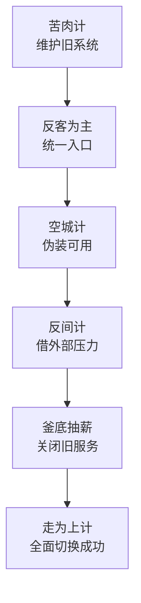

# 第三十五计：连环计

Stratagem 35: Chain Stratagems

---

### 古文原意

Original Meaning

> 多计并用，计中有计，层层设局，环环相扣。
> Use multiple stratagems in succession—one nested in another, each linked to reinforce the next.

---

### 程序员解读

Programmer's Interpretation
在系统设计、技术选型与版本规划中，常需多种手段协同施展：先稳旧系统（苦肉计）、引新接口（反客为主）、引入竞品（反间计），再整体换代（釜底抽薪）。每一步都是一环，缺一不可。
In architecture and planning, you often deploy several tactics in sequence: stabilize legacy (Stratagem 34), introduce new APIs (Stratagem 30), leverage competitor pressure (Stratagem 33), and finally cut off the old base (Stratagem 19). Each is a link in the chain.

---

### 实用场景

场景一：平台升级的多步谋划
Scenario 1: Multi-step Platform Upgrade

你先接手旧模块（苦肉计），吸引其他服务接入（反客为主），然后通过 mock 吸引外部接入（空城计），最终全体迁移新架构（走为上计）。
You first adopt the legacy (Stratagem 34), gain influence (30), lure usage via mock APIs (32), then phase out old system (36).

场景二：架构重构分阶段布局
Scenario 2: Phased Refactor with Nested Moves

你将网关流量重定向（声东击西），再逐步替换内部依赖（偷梁换柱），等竞争系统暴露短板时集中推广你的方案（混水摸鱼 + 树上开花）。
You first redirect traffic (Stratagem 6), then swap internals (25), and as rivals fail, you shine (20 + 29).

---

### 示例代码（C#）

Example Code (C#)

```csharp
// 连环计：每一步是阶段策略，最终形成闭环
// Multi-phase strategy execution

public class UpgradePlan
{
    public void Execute()
    {
        StabilizeLegacy();       // 苦肉计
        OfferUnifiedInterface(); // 反客为主
        MockEarlyAPI();          // 空城计
        PhaseOutLegacy();        // 走为上计
    }

    private void StabilizeLegacy() => Console.WriteLine("接手旧模块并稳定运行");
    private void OfferUnifiedInterface() => Console.WriteLine("设计统一 API，吸引他人依赖");
    private void MockEarlyAPI() => Console.WriteLine("提供模拟接口以推广接入");
    private void PhaseOutLegacy() => Console.WriteLine("关停旧系统，全面切换");
}
```

---

### Mermaid 流程图：环环相扣，谋而后动

Mermaid Diagram: Each Move Builds Upon the Last



---

### 格言

Maxim

> 单计可破，多计难防；计中之计，连环不息。
> A single stratagem may fail—chained ones overwhelm; within every trap, another awaits.
