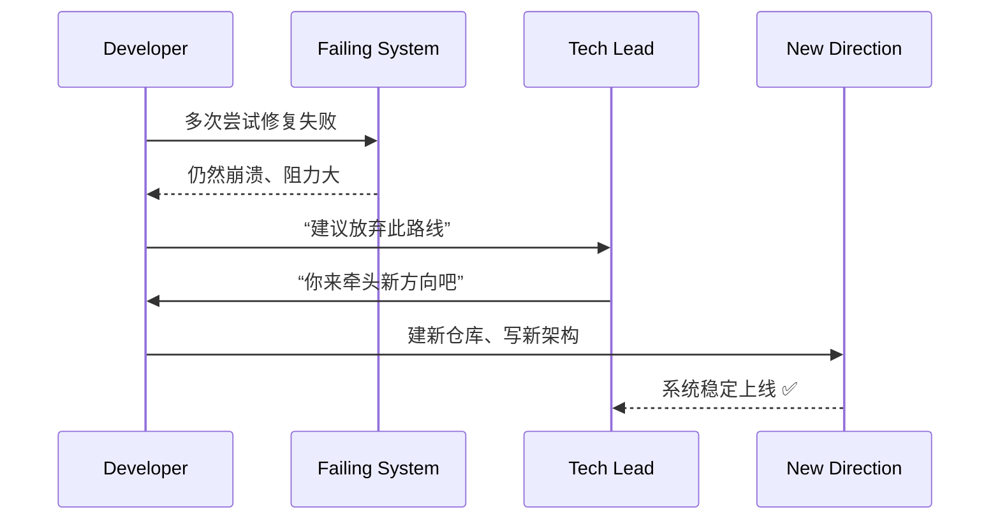

[Back to 目录（Index）](https://github.com/uwspstar/The-36-Stratagems-for-Programmers/blob/main/Index.md)

# 第三十六计：走为上计

Stratagem 36: Retreat Is the Best Option

---

### 古文原意

Original Meaning

> 局势不利时，不强求胜，以“退”为进，保留实力，图谋东山再起。
> When the situation is dire, the best plan is to retreat. Preserve strength, avoid destruction, and plan for the future.

---

### 程序员解读

Programmer's Interpretation
程序员不是无所不能。面对不可控的烂项目、不合理架构、错误技术选型，有时最智慧的选择是“及时止损”，选择退出、重构或战略性转向。
Not every battle is worth fighting. When trapped in failing tech, chaotic teams, or misaligned visions, the smartest move may be to **step away** and regroup.

---

### 实用场景

场景一：及时退出技术死胡同
Scenario 1: Exit a Dead-End Technology

你尝试使用某新框架，踩坑无数，迟迟不稳定。果断弃用，回归成熟方案，赢得全组时间。
You test a hot new framework, but it's buggy and slow. You cut losses and switch back to proven tech—saving your team.

场景二：脱离混乱组织结构
Scenario 2: Leave a Dysfunctional Org

你身处一个方向混乱、内部斗争频繁的项目组。在努力无果后，选择内部转岗或跳槽，开启新局。
You're in a toxic team. After trying to help with no result, you choose to transfer—resetting your career path.

---

### 示例代码（C#）

Example Code (C#)

```csharp
// 走为上计：放弃重构死路，另起炉灶
// Abandon the failing path, start fresh

public class Abandonment
{
    public void Execute()
    {
        Console.WriteLine("旧项目太烂，另起一个新仓库！");
        StartNewProject();
    }

    private void StartNewProject()
    {
        Console.WriteLine("新仓库架构清晰，按最佳实践开发！");
    }
}
```

---

### Mermaid 流程图：明退为进，另辟蹊径

Mermaid Diagram: Retreat Strategically, Rise Again



---

### 格言

Maxim

> 能进善攻者，亦能退而全身；退不是逃，而是谋局之始。
> A wise warrior knows when to fight—and when to walk away. Retreat is not failure, but the beginning of a new plan.
