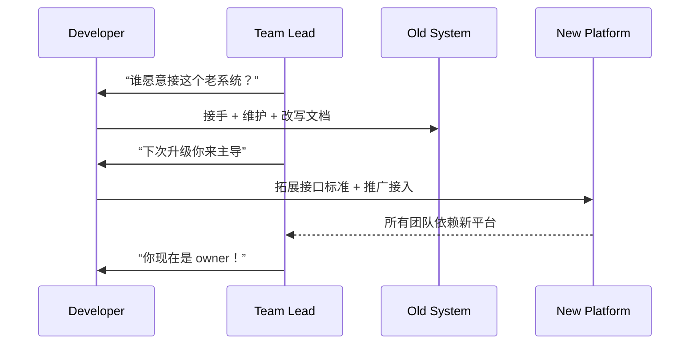

[Back to 目录（Index）](https://github.com/uwspstar/The-36-Stratagems-for-Programmers/blob/main/Index.md)

# 第三十四计：苦肉计

Stratagem 34: Inflict Injury on Yourself to Gain Trust

---

### 古文原意

Original Meaning

> 以自损换取敌人信任，隐忍伤痛，完成更深图谋。
> Inflict harm on yourself to win the enemy’s trust—bear short-term loss for long-term gain.

---

### 程序员解读

Programmer's Interpretation
在技术实施、跨部门协作或系统整合时，有时需“牺牲”局部利益或“自愿吃亏”来换取主导权或战略信任。
Sometimes, in implementation or cross-team alignment, you may need to **voluntarily take on pain or make concessions** to gain trust or strategic positioning.

例如你主动承担遗留系统维护、节假日上线值班，虽辛苦，却换来核心权限或后续架构主导地位。
For example, you volunteer for legacy support or weekend deployments. Tough work—but it wins you long-term influence and architecture ownership.

---

### 实用场景

场景一：主动扛下技术债，换取主导权
Scenario 1: Take the Pain to Earn Control

你接手脏乱差系统，边修边写文档，赢得管理层认可，后续重构时你成为第一发言人。
You adopt a messy legacy service, gradually stabilize it and document it. When the time for redesign comes—you’re in charge.

场景二：让利外部接口以换平台统治力
Scenario 2: Give API Credits to Gain Platform Ownership

你把平台部分能力免费开放，吸引外围团队接入，日后所有流量都汇聚到你的服务。
You offer parts of your service for free, onboarding more teams. Eventually, everyone depends on your platform.

---

### 示例代码（C#）

Example Code (C#)

```csharp
// 苦肉计：牺牲接口调用效率，换取统一接入方案
// Sacrifice performance for control

public class UnifiedAdapter
{
    public string GetData(string id)
    {
        // 实际比直连慢 1 秒，但统一了调用规范
        Thread.Sleep(1000); // 模拟延迟
        return CentralService.Fetch(id);
    }
}
```

---

### Mermaid 流程图：吃亏是福，掌控是赢

Mermaid Diagram: Take the Hit to Own the Game



---

### 格言

Maxim

> 忍一时之痛，换一世之权；吃亏不是退，而是为赢而伏。
> Endure short-term pain to earn lasting power; losing now may win you the future.
