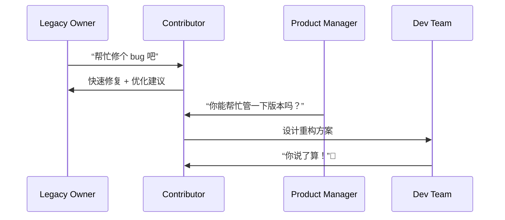

[Back to 目录（Index）](https://github.com/uwspstar/The-36-Stratagems-for-Programmers/blob/main/Index.md)

# 第三十计：反客为主

Stratagem 30: Turn the Guest into the Host

---

### 古文原意

Original Meaning

> 原为客体之人或势，逐步掌握主导权，取而代之。
> Someone in a subordinate or external position gradually takes control and becomes the dominant force.

---

### 程序员解读

Programmer's Interpretation
程序员在接手遗留项目、外部组件或协作模块时，若能掌握关键路径并提供更优方案，便可逐步“由客变主”，最终主导整个系统架构或方向。
When working on legacy code, external libraries, or cross-team features, a developer can subtly expand their influence—eventually becoming the central decision-maker.

例如你本是协助维护某模块，后因持续优化与补丁输出，逐步变成该模块的核心维护者与技术负责人。
For example, you start as a helper on a component. Through consistent improvements and bug fixes, you become its de facto owner.

---

### 实用场景

场景一：继承遗留系统后逆袭为主导者
Scenario 1: Inherit Legacy, Then Own It

你最初只是帮忙维护老项目，后来对其熟悉程度超过原作者，逐步重构并主导重写方向。
You’re asked to patch an old project. Over time, your understanding grows—you lead its refactor and redesign.

场景二：外包接口反向成为标准
Scenario 2: Your Module Becomes the Standard

你开发一个“小工具”嵌入他人平台，结果因性能与易用性出色，逐步取代原有流程成为核心。
You create a “helper” module. Its elegance and performance gradually make it the standard everyone adopts.

---

### 示例代码（C#）

Example Code (C#)

```csharp
// 反客为主：从辅助模块变成核心引擎
// Become the core through reliability

public class LegacyWrapper
{
    private readonly ICoreEngine _engine;

    public LegacyWrapper()
    {
        // 原本是旧模块
        _engine = new LegacyEngine();

        // 后来替换为新引擎
        if (NewEngine.IsStable)
        {
            _engine = new NewEngine(); // 客变主
        }
    }

    public void Execute(string input)
    {
        _engine.Run(input);
    }
}
```

---

### Mermaid 流程图：从协作到主导

Mermaid Diagram: From Assistant to Architect



---

### 格言

Maxim

> 起于微末，控于核心；由客入局，主其全局。
> Begin in shadow, rise to the center; enter as guest, command as host.
