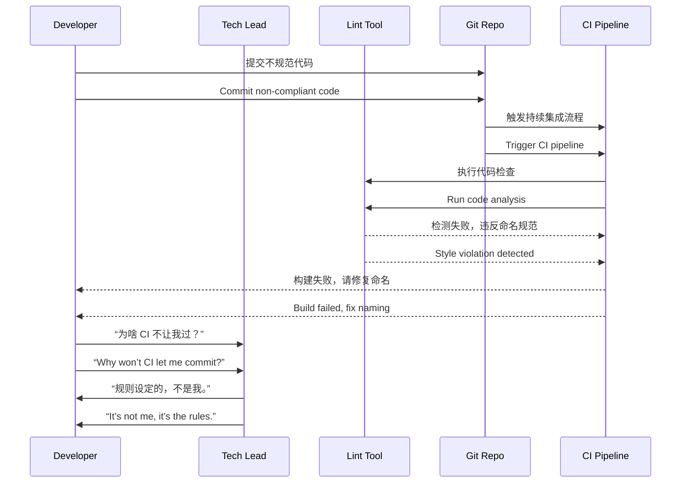

# 第三计：借刀杀人

Stratagem 03: Kill with a Borrowed Knife

---

### 古文原意

Original Meaning

> 借他人之力以除己敌；使敌人自相残杀，坐收渔利。
> Use another’s strength to eliminate your enemy; manipulate others to fight on your behalf, while you reap the benefit.

---

### 程序员解读

Programmer's Interpretation

当你无法直接解决技术难题、管理矛盾或权责冲突时，不妨借助外部资源、第三方规则、自动化机制或他人权威，实现目标。
When you cannot directly solve a technical issue, management conflict, or team blockage, consider leveraging external forces—third-party tools, protocols, audits, or authoritative voices—to accomplish your goal.

例如，推动代码规范或安全机制受阻，可以借助 CI 扫描器、代码审查机器人或安全部门“背书”，让制度替你执行。
For example, if enforcing code standards or security rules faces resistance, use CI scanners, code bots, or the security team's backing to let “the system” carry out your intent.

---

### 实用场景

Practical Scenarios

场景一：推行代码风格规范
Scenario 1: Enforcing Code Style Standards

工程师不愿接受你手动提出的代码建议。你引入自动化 Linter 工具，如 StyleCop 或 Prettier，让“机器”来拒绝不规范的提交。
Engineers resist your personal style comments. You introduce automated tools like StyleCop or Prettier to block non-compliant commits automatically.

场景二：推动接口解耦
Scenario 2: Driving Interface Decoupling

你想推动业务逻辑与控制器分离，但同事觉得“没必要”。你提出将系统接入 API Gateway 要求强制契约接口，自然促使他们配合。
You aim to separate business logic from controllers, but peers see no need. By integrating with an API Gateway that enforces contracts, you force their compliance via system design.

---

### 示例代码（C#）

Example Code (C#)

```csharp
// 借助 StyleCop 分析器，让规范自动执行
// Using StyleCop analyzer to enforce rules automatically

public class OrderService
{
    public void CreateOrder(string customerName, int qty)
    {
        // 缺少参数校验或命名不规范，手动沟通无效
        // Instead of arguing, let the analyzer flag this
        Console.WriteLine("Creating order...");
    }
}

// 配置文件：stylecop.json
/*
{
  "settings": {
    "namingRules": {
      "includeInferredTupleElementNames": true
    }
  }
}
*/
```

---

### Mermaid 流程图：用“系统机制”代替“人际冲突”

Mermaid Diagram: Replace Human Friction with System Enforcement



---

### 格言

Maxim

> 一刀不沾，自有利刃斩敌；是非不辩，让系统开口。
> Let your hands stay clean, while a borrowed blade strikes; argue not with words, let the system speak.
