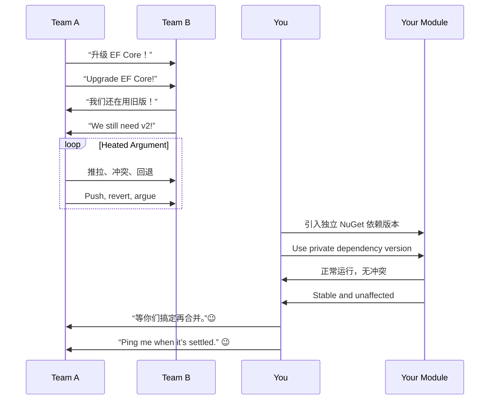

# 第九计：隔岸观火

Stratagem 09: Watch the Fire from the Other Side of the River

---

### 古文原意

Original Meaning

> 居高临下，静观其变；待敌自乱，不动而胜。
> Observe the chaos from a safe distance. Let the enemy burn themselves out—win without engaging.

---

### 程序员解读

Programmer's Interpretation

当多个系统、团队或方案陷入混乱，不妨暂不出手，保持观察，待局势明朗后再以最小代价介入，获取最大利益。
When multiple systems, teams, or solutions fall into disorder, sometimes the best move is no move—wait and watch. Once the dust settles, step in with minimal cost for maximum gain.

不是冷漠，而是战略克制。懂得“不过早参与”，也是一种高级技术判断。
This isn’t apathy—it’s strategic restraint. Knowing *when not to act* is a mark of technical maturity.

---

### 实用场景

Practical Scenarios

场景一：架构选型混战
Scenario 1: Architecture Selection Chaos

团队内围绕微服务、单体、Serverless 多派混战。你没有急着站队，而是等待各方案试点后再基于真实反馈选出最佳路径。
The team is torn between microservices, monolith, and Serverless. You don't pick sides, but wait for each to be trialed and then choose the one that proves itself.

场景二：版本冲突争执
Scenario 2: Dependency War Between Modules

多个组因依赖库版本不一致争吵不休。你先隔离模块版本，确保自己服务不受波及，等他们稳定后再逐步合并。
Multiple teams argue over conflicting dependency versions. You isolate your module to avoid impact, and only integrate once their fight is over.

---

### 示例代码（C#）

Example Code (C#)

```csharp
// 隔岸观火：避免依赖混乱，使用本地隔离方式观察事态发展
// Watch version conflict from afar, use local isolation

public class SafeJsonParser
{
    public static T Parse<T>(string json)
    {
        // 使用自带 Newtonsoft.Json 实例，不受全局引用影响
        var settings = new JsonSerializerSettings
        {
            MissingMemberHandling = MissingMemberHandling.Ignore
        };

        return JsonConvert.DeserializeObject<T>(json, settings);
    }
}
```

---

### Mermaid 流程图：他人混战，我方静观

Mermaid Diagram: Let Others Burn, We Stay Cool



---

### 格言

Maxim

> 火起彼岸，勿急自焚；静坐高台，掌控时局。
> Let the flames rage across the river, but stay dry on high ground; sit in silence, yet control the timing of all moves.
