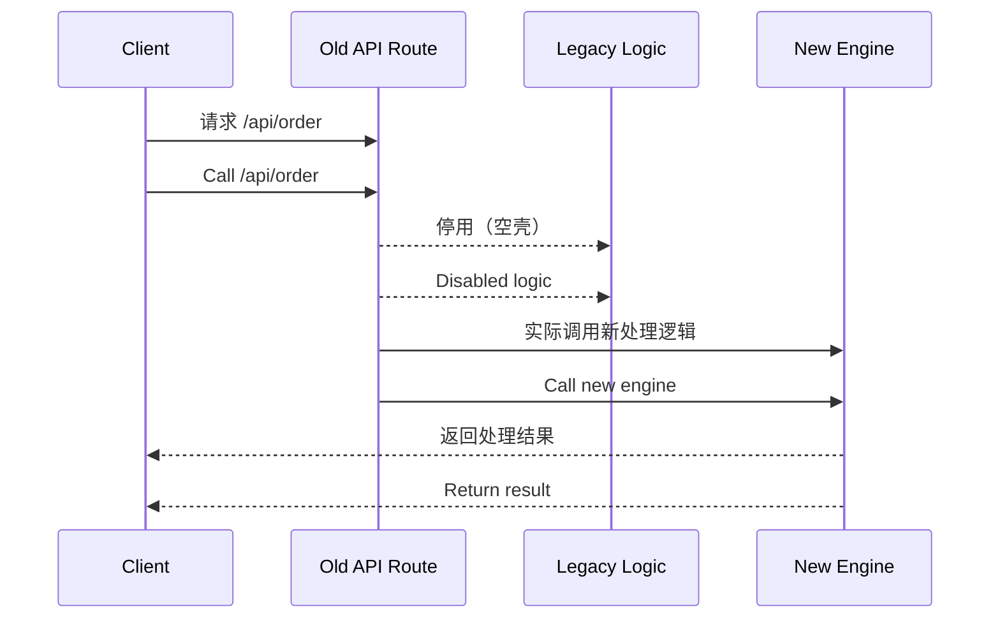

# 第二十一计：金蝉脱壳

Stratagem 21: The Cicada Sheds Its Shell

---

### 古文原意

Original Meaning

> 留下假象掩人耳目，真身早已转移，以退为进，巧避其锋。
> Leave behind an illusion to confuse others while the real self escapes. Retreat as advancement—evade confrontation through misdirection.

---

### 程序员解读

Programmer's Interpretation

当系统、项目或角色面临强压、瓶颈或风险时，不必硬拼。可以保留“壳”，逐步将核心转移，悄然完成脱身、转型、替代或迭代。
When a system, project, or role is facing heavy pressure, limitations, or risks—don’t confront directly. Keep the “shell” intact while quietly transitioning the core. Complete escape, replacement, or transformation unnoticed.

例如，你不立即废弃旧系统，而是保留接口壳子，内部接入新模块，实现平滑过渡。
For instance, instead of retiring a legacy system outright, you keep the same API endpoints but wire them to a new module internally—ensuring seamless migration.

---

### 实用场景

场景一：保留旧 API 实现新逻辑
Scenario 1: Keep the Interface, Swap the Engine

为减少风险，你没有停用旧订单 API，而是保留相同路径，接口内部换为新订单处理引擎。
To reduce risk, you keep the same `/api/order` endpoint—but behind the scenes, route it to the new engine.

场景二：转型过程中保留职位形式
Scenario 2: Role Transition with Visible Continuity

你希望从编码转向架构角色，仍参与部分开发会议、保留“开发者”头衔，但日常已主导架构评审与设计。
You want to move into an architect role. You still attend dev meetings and keep the “developer” title—but your real focus is now design reviews and architecture.

---

### 示例代码（C#）

Example Code (C#)

```csharp
// 金蝉脱壳：表面使用旧 API，实际走新模块
// Same endpoint, different implementation

[ApiController]
[Route("api/order")]
public class OrderController : ControllerBase
{
    private readonly INewOrderProcessor _processor;

    public OrderController(INewOrderProcessor processor)
    {
        _processor = processor;
    }

    [HttpPost]
    public IActionResult Create([FromBody] OrderDto order)
    {
        // 旧接口路径，实为新引擎处理
        var result = _processor.Process(order);
        return Ok(result);
    }
}
```

---

### Mermaid 流程图：外留旧形，内走新魂

Mermaid Diagram: Old Shell Outside, New Core Within



---

### 格言

Maxim

> 留形不留神，转移在无声；壳在其处，神已他往。
> The form remains, the spirit moves; while they watch the shell, the soul walks free.
