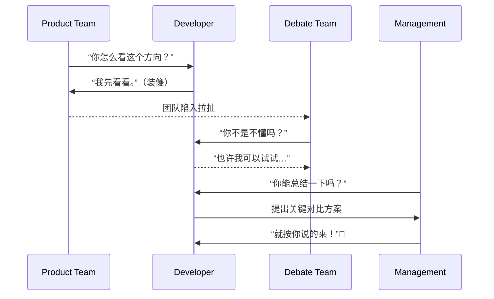

# 第二十七计：假痴不癫

Stratagem 27: Feign Madness But Keep Your Balance

---

### 古文原意

Original Meaning

> 表面装傻，实则深藏锋芒；避锋避祸，伺机而动。
> Pretend to be foolish or weak, while actually being calm and calculating—avoiding conflict, awaiting the right moment.

---

### 程序员解读

Programmer's Interpretation

在职场政治、团队变动或重大提案推进时，故意“装傻”或不主动出头，有时是一种智慧的自保与布局之术。
In workplace politics, org shifts, or sensitive projects, pretending not to notice, or holding back your true ability, can be a wise strategy to avoid danger and position yourself better.

例如面对方向混乱的产品团队，不急于表达不同意见，而是在关键节点以一招制胜；或被卷入争议时，表面不参与，实际掌握全局。
For example, when the product team is disorganized, you stay silent—until the right moment to propose a winning solution. Or you avoid visible conflict but understand all sides.

---

### 实用场景

场景一：隐藏真实能力
Scenario 1: Hide Your Real Strength

你被分配重复性工作，并未争辩，而是默默用脚本自动化处理，留有充足时间观察团队结构与漏洞。
You’re given boring repetitive tasks. Instead of protesting, you automate them quietly—leaving yourself time to analyze team dynamics.

场景二：装“中立”实则掌控节奏
Scenario 2: Act Neutral While Steering Outcome

架构争议中你不急表态，最后在领导需要决策时，用一张对比图一锤定音，赢得信任。
You stay quiet in an architecture debate—then when leadership asks for clarity, you present a concise comparison chart and win support.

---

### 示例代码（C#）

Example Code (C#)

```csharp
// 假痴不癫：表面做重复劳动，实则已自动化全部流程
// Appear to be doing it manually—actually automated

public class ReportTask
{
    // 表面上每天手动生成报表
    public void DailyTask()
    {
        Console.WriteLine("正在生成日报...");
        GenerateReport();
    }

    // 实际通过定时器全自动执行
    private void GenerateReport()
    {
        var data = ReportEngine.GetData();
        File.WriteAllText("report.json", data);
        Console.WriteLine("日报生成完毕 ✅");
    }
}
```

---

### Mermaid 流程图：装傻藏锋，静中制动

Mermaid Diagram: Hide the Blade, Wait in Calm



---

### 格言

Maxim

> 表面糊涂，心中有数；避其锋芒，以静制动。
> Seem clueless, think clearly; hide your edge, act at the right time.
