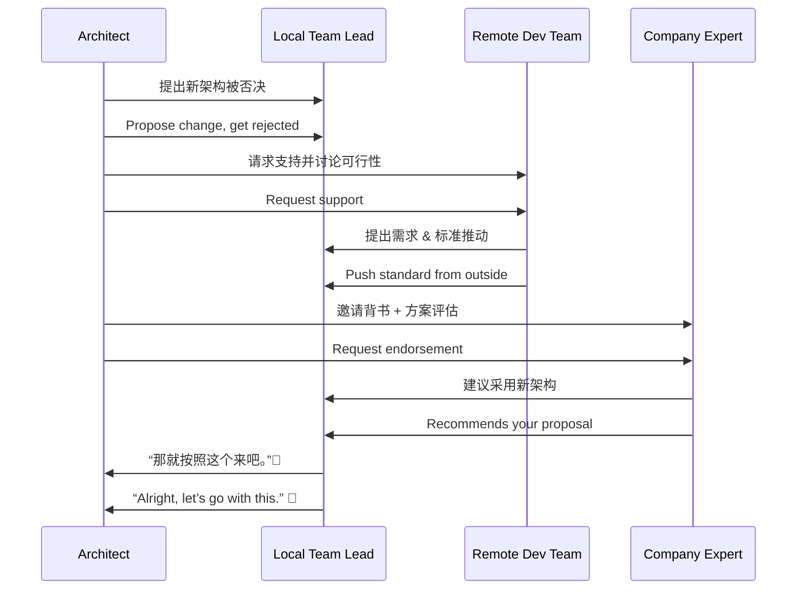

# 第二十三计：远交近攻

Stratagem 23: Befriend Distant States While Attacking Nearby Ones

---

### 古文原意

Original Meaning

> 联合远方势力，孤立周边敌人；削弱敌对联盟，集中力量进攻近邻。
> Ally with distant forces to isolate and weaken those nearby; break hostile alliances and attack those closest first.

---

### 程序员解读

Programmer's Interpretation

在团队合作、技术选型或资源协调中，与远端或“旁系”力量合作，共同对抗眼前的障碍或阻力，是推动变革的有效策略。
In tech decisions, team politics, or project struggles, allying with external or less-involved parties can help break through local resistance and push progress.

例如，你提出新方案遭主团队反对，但远程团队或产品方支持，你借此联合之力突破内部阻力。
For instance, your proposal is blocked by local leads, but an external team supports it. You build a coalition with them to gain momentum and succeed.

---

### 实用场景

场景一：远端团队支持推动技术选型
Scenario 1: Leverage Remote Team to Push Change

你在本地推动 gRPC 替换 REST 遇阻，而远程服务调用团队强烈支持，你借此共同推动跨服务标准化。
Your local team resists adopting gRPC, but remote teams favor it for performance. You partner with them to establish it as a cross-team standard.

场景二：引入外部专家破除内部僵局
Scenario 2: Bring in External Authority

你在架构方案中久议不决，借助公司专家顾问的意见做背书，成功打破僵局。
A heated architecture debate stalls. You involve an expert advisor, whose support shifts the consensus in your favor.

---

### 示例代码（C#）

Example Code (C#)

```csharp
// 远交近攻：引入远程模块或团队标准突破本地限制
// Bring in remote library to shift local resistance

public class RemoteGrpcClient
{
    private readonly Channel _channel;
    private readonly ExternalService.ExternalServiceClient _client;

    public RemoteGrpcClient(string url)
    {
        _channel = new Channel(url, ChannelCredentials.Insecure);
        _client = new ExternalService.ExternalServiceClient(_channel);
    }

    public async Task<string> GetDataAsync(string id)
    {
        var request = new DataRequest { Id = id };
        var response = await _client.GetDataAsync(request);
        return response.Value;
    }
}
```

---

### Mermaid 流程图：借远力破近敌

Mermaid Diagram: Use Distant Ally to Defeat Local Opposition



---

### 格言

Maxim

> 攻难攻之敌，需引他势合；近敌当克，远交为先。
> To break the closest threat, first unite with the far; ally afar, strike near.
