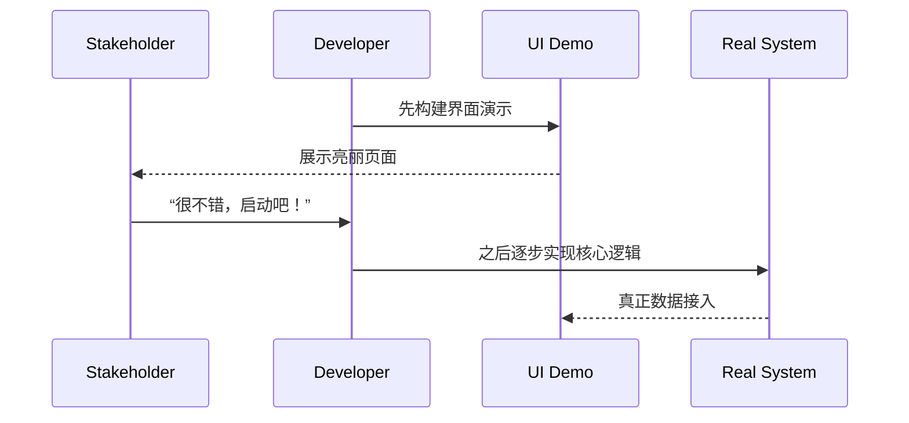

# 第二十九计：树上开花

Stratagem 29: Decorate the Tree with Fake Blossoms

---

### 古文原意

Original Meaning

> 利用假象制造繁荣或实力假象，以达到震慑或吸引目的。
> Use illusions to create a false appearance of strength or prosperity—deceiving others or gaining leverage.

---

### 程序员解读

Programmer's Interpretation
在初期项目展示、技术选型验证或汇报展示时，有时需“点缀包装”以获得支持或吸引资源，虽功能未全备，但展示出战略方向或系统潜力。
In early-stage demos, tech adoption, or stakeholder meetings, sometimes you “dress the tree with flowers”—building a polished prototype or partial mock to gain buy-in or momentum.

例如：展示一个 UI 原型或伪装后的 API，虽然功能尚未完备，但足以获取项目支持或赢得外部信任。
For example, demo a sleek UI or mock API—even though real logic isn't complete yet—to get stakeholder approval.

---

### 实用场景

场景一：项目立项展示
Scenario 1: Dazzle for Funding

你展示的是前端页面 + mock 数据，暂未接后端，但界面流程完整、数据有说服力，引发客户兴趣。
You show a UI + mock data demo—no backend yet—but the story convinces stakeholders to fund the project.

场景二：内部推广 MVP
Scenario 2: Gain Internal Buy-In

为了推动团队使用你设计的服务网关，你搭建了一个假“全功能控制台”演示界面，吸引数个团队开始试用。
You present a fake “full-featured console” for your service gateway. Even if backend is partial, teams get interested and start adopting.

---

### 示例代码（C#）

Example Code (C#)

```csharp
// 树上开花：展示伪功能，制造真实吸引力
// Fake it till you make it – build UI before full logic

[ApiController]
[Route("api/user")]
public class UserMockController : ControllerBase
{
    [HttpGet("{id}")]
    public IActionResult GetUser(string id)
    {
        // 假数据返回，展示用途
        return Ok(new {
            Id = id,
            Name = "Mock User",
            Role = "Admin",
            LastLogin = DateTime.UtcNow
        });
    }
}
```

---

### Mermaid 流程图：先亮花，再养果

Mermaid Diagram: Fake Bloom to Attract Real Growth



---

### 格言

Maxim

> 虚花一现，实果日长；先夺眼球，再养根基。
> False blossoms bloom bright, but the real fruit takes time; first win eyes, then build roots.
