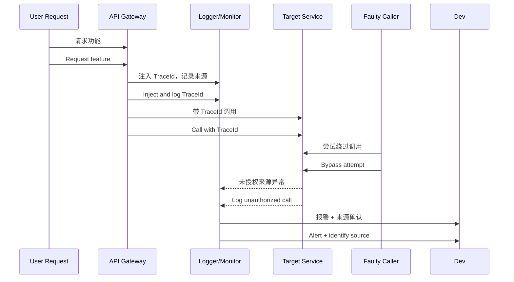

[Back to 目录（Index）](https://github.com/uwspstar/The-36-Stratagems-for-Programmers/blob/main/Index.md)

# 第二十二计：关门捉贼

Stratagem 22: Shut the Door and Catch the Thief

---

### 古文原意

Original Meaning

> 切断退路，封锁出入口，使敌无处可逃，再行围歼。
> Block all escape routes, encircle completely—once the enemy is trapped, strike decisively.

---

### 程序员解读

Programmer's Interpretation

当需要解决隐蔽 bug、查明系统瓶颈、暴露责任归属时，不妨先设置“监控围墙”，关上所有“后门”，让问题无处遁形、让责任明晰可见，再对症下药。
When debugging hidden issues, tracking bottlenecks, or clarifying responsibility, first surround the system with observability—close all exits, remove ambiguity. Then strike precisely.

例如，为了查出频繁超时请求，你设置详细日志与请求链路追踪，禁止绕过 API，最终定位出具体接口异常。
For example, to investigate timeout issues, you set up logging and trace enforcement, disallow bypasses—until the real cause reveals itself.

---

### 实用场景

场景一：定位异常链路
Scenario 1: Trap the Faulty Path

系统间调用混乱，出错日志无来源。你设置 TraceId 全链路传递，关闭全部“匿名调用”，问题很快暴露。
With unclear service logs, you enforce `TraceId` propagation and block all anonymous calls. The faulty service surfaces quickly.

场景二：权限问题排查
Scenario 2: Isolating Access Violations

某功能被频繁误触发但无日志。你将该模块封装进只允许特定入口的 API，最终抓到错误调用者。
A sensitive module is misused with no trace. You wrap it in a guarded API, then catch the misuse source.

---

### 示例代码（C#）

Example Code (C#)

```csharp
// 关门捉贼：加日志、限入口、封路径，强行定位异常
// Close all exits, enforce trace

public class SecureFeatureService
{
    public string ExecuteFeature(string userId, string source)
    {
        if (string.IsNullOrEmpty(source))
        {
            throw new UnauthorizedAccessException("Missing source ID");
        }

        Logger.Log($"[FeatureCall] User: {userId}, Source: {source}, Time: {DateTime.UtcNow}");

        // 真正的功能调用
        return "Feature Executed";
    }
}
```

---

### Mermaid 流程图：封锁漏洞，揪出根因

Mermaid Diagram: Lock the Gates, Catch the Source



---

### 格言

Maxim

> 欲擒先围，欲明先封；封其去路，显其真形。
> To catch, first enclose; to know, first isolate—seal the exits, truth will emerge.
