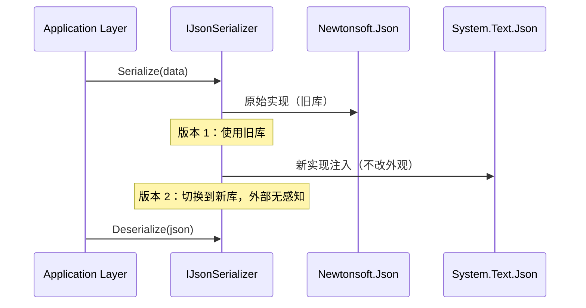

# 第二十五计：偷梁换柱

Stratagem 25: Replace the Beams with Rotten Timbers

---

### 古文原意

Original Meaning

> 偷偷更换关键结构，让对方在不知不觉中陷入不利。
> Replace key components silently; deceive the target into depending on something fundamentally altered or weakened.

---

### 程序员解读

Programmer's Interpretation

在系统迁移或架构演进中，常需“悄无声息”地替换旧有依赖、组件或服务接口。在对方或用户毫无察觉下，完成新版替代或架构清洗。
In system upgrades or architecture evolution, sometimes it's best to **silently replace** outdated components or dependencies—ensuring a smooth switch without disruption or user awareness.

比如将老旧 ORM 替换为 Dapper，保持接口不变；或者在旧网关逻辑中嵌入新认证模块，逐步替换逻辑核心。
For example, replace an old ORM with Dapper under the same interface, or embed a new auth service into an old gateway without changing its outward behavior.

---

### 实用场景

场景一：替换老库保持接口一致
Scenario 1: Swap Legacy Library with Same Interface

原来项目使用 Newtonsoft.Json，你重写代码以接口方式注入 System.Text.Json，实现性能提升却无需改动上层逻辑。
The project uses Newtonsoft.Json. You abstract the JSON interface and inject `System.Text.Json` underneath—boosting performance without touching the logic above.

场景二：平滑切换微服务路由
Scenario 2: Seamless Routing Transition

你用反向代理将部分请求从旧服务导流至新服务，用户无感知，系统完成平滑迁移。
You configure reverse proxy routing so some traffic shifts to a new service. Users remain unaware as the system transitions smoothly.

---

### 示例代码（C#）

Example Code (C#)

```csharp
// 偷梁换柱：替换内部实现，外部调用无感知
// Swap logic inside, keep interface unchanged

public interface IJsonSerializer
{
    string Serialize<T>(T obj);
    T Deserialize<T>(string json);
}

public class SystemTextJsonSerializer : IJsonSerializer
{
    public string Serialize<T>(T obj)
        => System.Text.Json.JsonSerializer.Serialize(obj);

    public T Deserialize<T>(string json)
        => System.Text.Json.JsonSerializer.Deserialize<T>(json);
}

// 原代码调用 IJsonSerializer，不受影响
```

---

### Mermaid 流程图：表面不动，核心已换

Mermaid Diagram: Interface Stays, Core Changes



---

### 格言

Maxim

> 形似旧柱，神换新梁；表不变，里已新。
> The beam looks old, but the soul is new; the surface unchanged, the core renewed.
