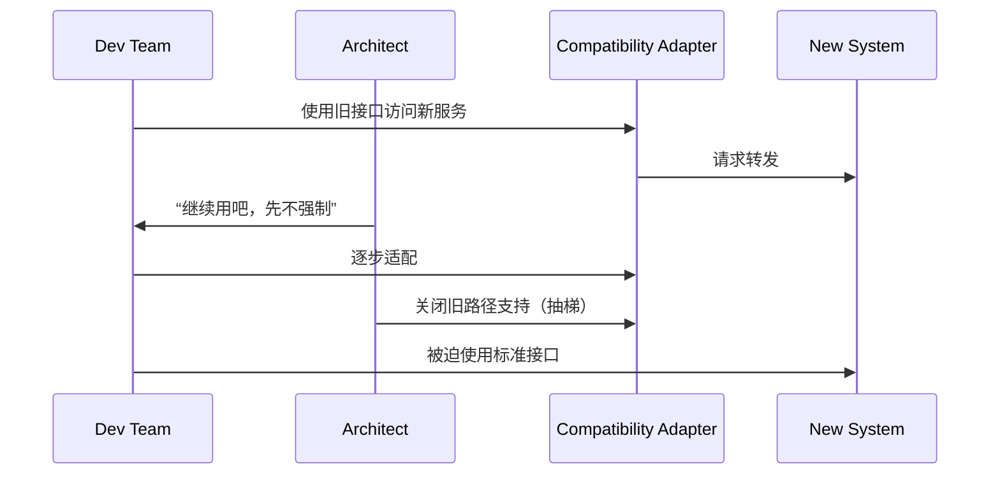

# 第二十八计：上屋抽梯

Stratagem 28: Remove the Ladder When the Enemy Has Ascended

---

### 古文原意

Original Meaning

> 引诱敌人登高后断其退路，使其进退维谷，最终被擒。
> Lure your opponent to a high place, then remove the ladder—leave them stranded, unable to retreat or escape.

---

### 程序员解读

Programmer's Interpretation
在协作开发或系统演进中，可引导对方进入你设计的架构体系或技术栈，然后断绝其回退通道，使其不得不接受你主导的方向。
In collaboration or tech design, you may guide others into adopting your framework or standard, then cut off legacy paths—so they must move forward under your lead.

例如，先允许团队使用旧接口访问你的新服务，再逐步关闭旧接口，强迫他们升级迁移。
For instance, allow others to access your service via legacy APIs, then phase them out—forcing a full upgrade.

---

### 实用场景

场景一：强制推进技术升级
Scenario 1: Forcing a Tech Upgrade

你提供向后兼容的桥接服务，团队逐步迁移至新平台；待大部分稳定后关闭旧桥接，促成全面切换。
You offer a backward-compatible bridge; once most teams migrate, you retire it—forcing full adoption of the new system.

场景二：项目转型借势断回头路
Scenario 2: Remove Rollback Options Strategically

你推动微服务拆分，先在旧平台留有同步入口；待数据稳定后关闭双写接口，使新服务成为唯一入口。
During microservice adoption, you allow dual writes—then disable the legacy writes, locking in the new design.

---

### 示例代码（C#）

Example Code (C#)

```csharp
// 上屋抽梯：阶段性保留旧接口，最终强制升级
// Phase-out pattern: allow fallback, then remove

public class LegacyAdapter
{
    private readonly bool legacyEnabled = false;

    public string FetchData(string id)
    {
        if (legacyEnabled)
        {
            // Legacy fallback (to be removed)
            return LegacyService.Get(id);
        }

        // New standard access
        return NewService.Fetch(id);
    }
}
```

---

### Mermaid 流程图：先诱后断，促其前行

Mermaid Diagram: Lure Up, Then Remove Ladder



---

### 格言

Maxim

> 先给退路，引人上楼；待其登顶，断其回头。
> First offer retreat, then lead them up; once they're high, remove the way back.
