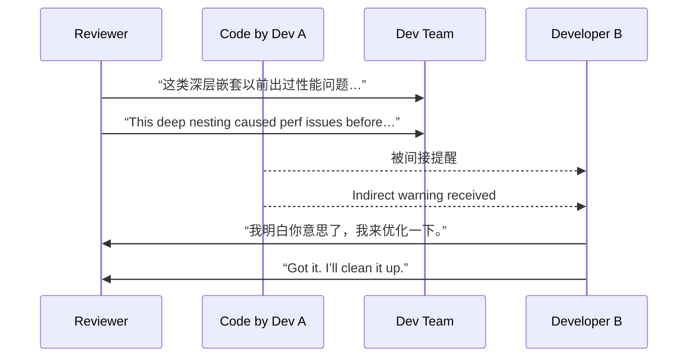

[Back to 目录（Index）](https://github.com/uwspstar/The-36-Stratagems-for-Programmers/blob/main/Index.md)

# 第二十六计：指桑骂槐

Stratagem 26: Point at the Mulberry Tree While Cursing the Locust Tree

---

### 古文原意

Original Meaning

> 表面上责骂 A，实则影射 B；通过旁敲侧击，表达真正意图。
> Scold the mulberry while targeting the locust—indirectly criticize or warn the real target through metaphor or proxy.

---

### 程序员解读

Programmer's Interpretation

在技术讨论、团队协作或代码评审中，直接批评某人或方案可能引发对立。此时，可借“评价某段代码”或“总结一个通用问题”的方式，委婉指出问题，达成提醒与纠正的目的。
In code reviews, architecture meetings, or team discussions, direct criticism may create friction. Instead, you can tactfully refer to similar patterns or hypothetical cases to convey your concerns.

比如代码评审时，不直接说“你这段太糟”，而是“我们之前在另一处遇到类似问题，建议优化为 xxx”。
For instance, instead of saying “Your code is terrible,” you say, “We’ve had issues in a similar pattern before—maybe try doing xxx.”

---

### 实用场景

场景一：代码评审中的委婉提醒
Scenario 1: Indirect Feedback in Code Review

你不直接批评某人糟糕写法，而是在评审中分享“过去团队踩过的坑”，实则暗示当前写法有风险。
Rather than pointing fingers, you tell a story about a prior bug the team faced due to similar logic—gently nudging the developer to rethink.

场景二：会议中引导变革
Scenario 2: Steering a Meeting via Analogy

你想推动弃用某旧工具，但不直说，而是提出“我们是否可以看看哪些老工具维护成本越来越高？”借此开启替代方案讨论。
Instead of demanding to ditch an old tool, you ask, “Should we review any legacy tools that may be dragging us down?”—thus opening the floor.

---

### 示例代码（C#）

Example Code (C#)

```csharp
// 指桑骂槐：在 Code Review 中间接指出问题
// Indirect warning during code review

// Review Comment:
// “我们之前在某个地方也是这么写的，后来发现性能瓶颈来自这类循环嵌套，建议改用 LINQ。”

var result = new List<int>();
foreach (var item in list)
{
    if (item.IsActive)
    {
        foreach (var sub in item.Children)
        {
            if (sub.IsValid)
                result.Add(sub.Id);
        }
    }
}

// 实际建议：
var result = list
    .Where(x => x.IsActive)
    .SelectMany(x => x.Children)
    .Where(c => c.IsValid)
    .Select(c => c.Id)
    .ToList();
```

---

### Mermaid 流程图：话中有话，意在他人

Mermaid Diagram: One Target Spoken, Another Meant



---

### 格言

Maxim

> 表扬其人，批其影；言在此处，意在彼方。
> Praise the seen, strike the unseen; words say one thing, meanings land elsewhere.
