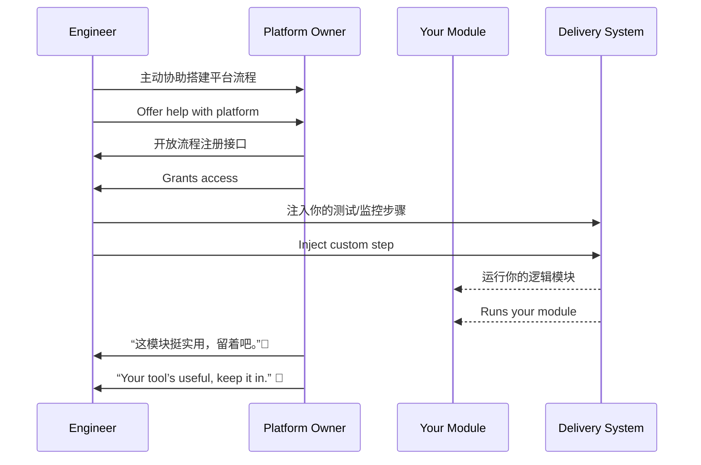

[Back to 目录（Index）](https://github.com/uwspstar/The-36-Stratagems-for-Programmers/blob/main/Index.md)

# 第二十四计：假道伐虢

Stratagem 24: Obtain Safe Passage to Conquer the Kingdom

---

### 古文原意

Original Meaning

> 借助他人通道或资源，达成自己的战略目的。表面合作，实为手段。
> Request passage or cooperation under a pretense—but use it to pursue your own goal. Seize the opportunity beneath collaboration.

---

### 程序员解读

Programmer's Interpretation

在项目合作、平台共建或数据接入时，表面是支援他人，实则为自身铺路或获得资源。以“合作”为名，达成技术或业务突破。
In tech collaboration or platform integration, you may appear to help others, but the deeper goal is building your own leverage—expanding access, visibility, or influence under the flag of collaboration.

例如，你参与别人的工具开发，实际目的是将你的组件无缝接入核心流程。
For example, you join another team’s tool project—not only to help, but also to ensure your module becomes part of their release flow.

---

### 实用场景

场景一：借平台接入自身组件
Scenario 1: Integrate Your Module via Another Platform

你主动帮助搭建 CI/CD 平台，借此让你的测试模块变成默认流程节点，其他团队也开始依赖你的组件。
You volunteer to help build CI/CD. In doing so, your test tool becomes a default step—adopted team-wide.

场景二：以文档协助换取权限入口
Scenario 2: Exchange Documentation for Strategic Access

你为其他组梳理 API 文档与 SDK 封装，作为交换获得其系统的访问令牌权限。
You document and package another team’s APIs—and gain key access credentials as a result.

---

### 示例代码（C#）

Example Code (C#)

```csharp
// 假道伐虢：以“协作”为名，接入并扩展自己模块影响力
// Collaborate externally to embed your logic internally

public class BuildPipeline
{
    public void RegisterSteps()
    {
        // 加入他人平台构建流程
        ExternalPipeline.AddStep("Init", InitEnv);
        ExternalPipeline.AddStep("Test", RunMyCustomTest); // 实则推广你的模块
    }

    private void InitEnv() => Console.WriteLine("Env Initialized");
    private void RunMyCustomTest() => Console.WriteLine("✅ My Module Integrated");
}
```

---

### Mermaid 流程图：借他之道，成我之功

Mermaid Diagram: Borrow the Road, Achieve Your Goal



---

### 格言

Maxim

> 借力打力，顺水行舟；合作之名，嵌入之计。
> Ride on borrowed roads, sail with borrowed winds; collaboration in name, expansion in essence.
