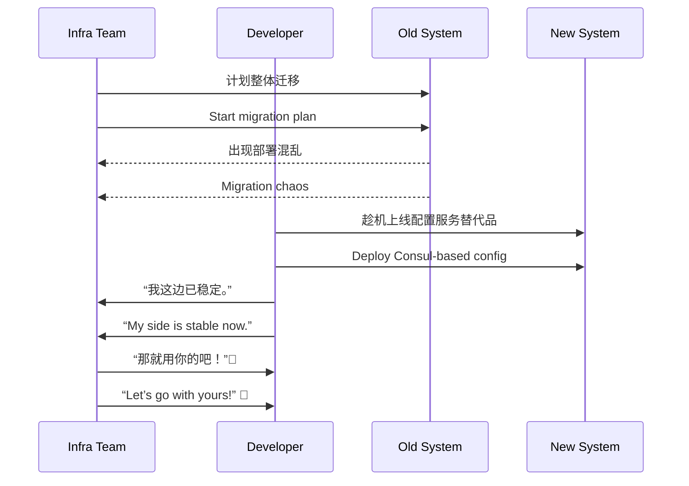

[Back to 目录（Index）](https://github.com/uwspstar/The-36-Stratagems-for-Programmers/blob/main/Index.md)

# 第二十计：混水摸鱼

Stratagem 20: Fish in Troubled Waters

---

### 古文原意

Original Meaning

> 趁局势混乱之际行动，从中牟利；敌乱我静，借乱为机。
> Take advantage of chaos to act for personal gain. Remain calm amid disorder and use confusion to your benefit.

---

### 程序员解读

Programmer's Interpretation

在系统升级、组织重组、紧急修复、产品迭代等混乱场景中，不被干扰，反而抓住时机推进原本难以落地的方案、架构或角色转换。
In moments of system migration, team shakeups, urgent incidents, or rapid product pivots—don’t panic. Use the confusion to push through proposals or changes that would usually be resisted.

例如，趁迁移平台之际，悄悄重构旧接口；或在组织换架中，提出你长期想做的架构改革并顺利主导。
For example, during a platform migration, slip in a refactor. Or during an org restructure, surface that long-desired architecture plan—and get greenlit.

---

### 实用场景

场景一：平台切换之际更新架构
Scenario 1: Upgrade Architecture During Platform Chaos

系统迁移到 Kubernetes 期间部署混乱，你趁此重写了配置中心模块，顺利用上了你推荐已久的 Consul。
While teams scramble to deploy on Kubernetes, you take the chance to refactor the config module—and replace it with your preferred Consul setup.

场景二：组织重组中角色升级
Scenario 2: Team Restructure Opens Opportunity

公司合并重组，团队缺少负责人，你主动承担关键交付，稳定混乱局面后自然升任项目负责人。
Amid a reorg, leadership is unclear. You stabilize a critical delivery, and soon you're the natural choice for lead.

---

### 示例代码（C#）

Example Code (C#)

```csharp
// 混水摸鱼：趁部署混乱悄然升级配置服务
// During chaos, upgrade what you'd usually be blocked from

public class ConfigService
{
    public string GetConfig(string key)
    {
        // 旧逻辑：从 XML 文件读取
        // return File.ReadAllText($"config/{key}.xml");

        // 新逻辑：接入 Consul
        return ConsulClient.GetValue(key);
    }
}
```

---

### Mermaid 流程图：局乱我稳，混中出击

Mermaid Diagram: Calm in Chaos, Opportunity Seized



---

### 格言

Maxim

> 局乱非退机，乃是登场时；他人迷失，我自稳行。
> Disorder is no time to retreat—but to emerge; while others are lost, I move with clarity.
