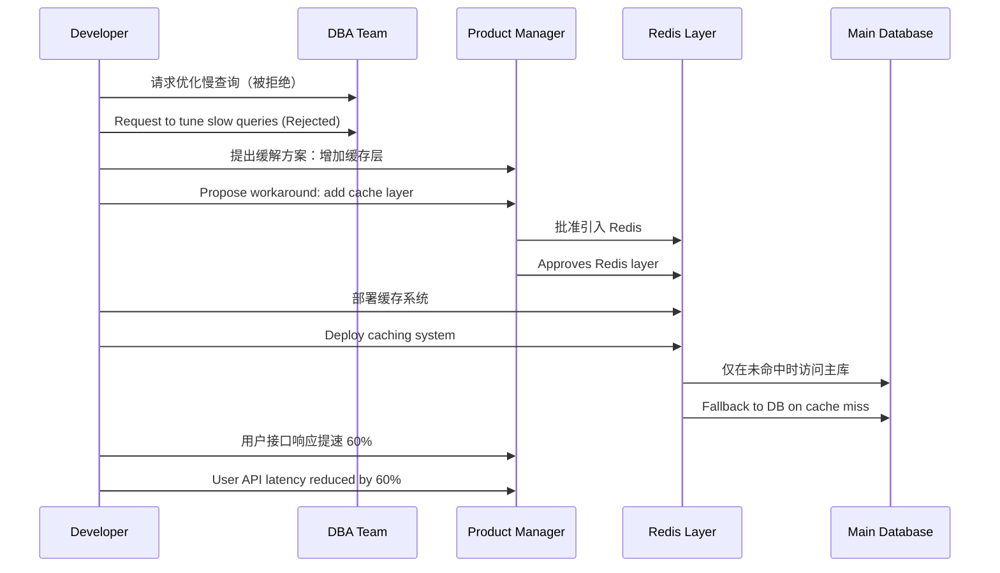

# 第二计：围魏救赵

Stratagem 02: Besiege Wei to Rescue Zhao

---

### 古文原意

Original Meaning

> 敌强不可正敌，则攻其所必救。出其不意，敌自乱阵。
> When the enemy is too strong to attack directly, strike at what he must protect. Surprise him, and his forces will scatter.

---

### 程序员解读

Programmer's Interpretation

当你无法直接解决项目中的核心阻力，或推进方案遭遇高压阻挡，不妨转向间接路径，绕过正面冲突。
When you cannot tackle a project bottleneck head-on or your proposal faces strong resistance, consider approaching indirectly to avoid direct confrontation.

例如，推动技术改革屡次被业务方否决，可以转向提升其他模块质量或优化他们依赖的外围系统，反过来激发他们主动合作。
For example, if your tech reform plans are repeatedly rejected by business stakeholders, improve quality in peripheral systems they rely on. This may create indirect leverage and lead them to seek your support.

---

### 实用场景

Practical Scenarios

场景一：CI/CD 工具改革
Scenario 1: Reforming CI/CD Pipeline

你想替换旧有的 Jenkins，但核心系统团队坚持保守。你转而提升测试框架效率，让外围团队逐步迁移到 GitHub Actions，最终反过来推动中心团队跟进。
You want to replace legacy Jenkins, but the core team resists. You instead improve the testing pipeline and enable outer teams to move to GitHub Actions, eventually pressuring the core to follow.

场景二：无法解决数据库瓶颈
Scenario 2: Stuck on Database Bottlenecks

主库查询缓慢，却无法获取 DBA 配合调优。你绕道搭建 Redis 缓存服务为高频接口减负，间接缓解性能问题。
The database is slow, but the DBAs are uncooperative. You build a Redis cache layer to relieve pressure on the core database, thus solving the problem indirectly.

---

### 示例代码（C#）

Example Code (C#)

```csharp
// 目标无法直接优化数据库查询 => 转而构建 Redis 缓存
// Can't optimize DB directly => Build Redis cache as workaround

public class CachedUserService
{
    private readonly IDatabase _redis;
    private readonly IUserRepository _repo;

    public CachedUserService(IConnectionMultiplexer redis, IUserRepository repo)
    {
        _redis = redis.GetDatabase();
        _repo = repo;
    }

    public async Task<User> GetUserAsync(int id)
    {
        var cacheKey = $"user:{id}";
        var cached = await _redis.StringGetAsync(cacheKey);
        if (cached.HasValue)
        {
            return JsonSerializer.Deserialize<User>(cached);
        }

        var user = await _repo.GetUserAsync(id);
        await _redis.StringSetAsync(cacheKey, JsonSerializer.Serialize(user), TimeSpan.FromMinutes(10));
        return user;
    }
}
```

---

### Mermaid 流程图：以侧击代替正面强攻

Mermaid Diagram: Flanking the Core Issue



---

### 格言

Maxim

> 正面难破，侧翼可施；困局不攻，转向图解。
> When the front won't break, flank it; when the problem is stuck, turn and solve from the side.
