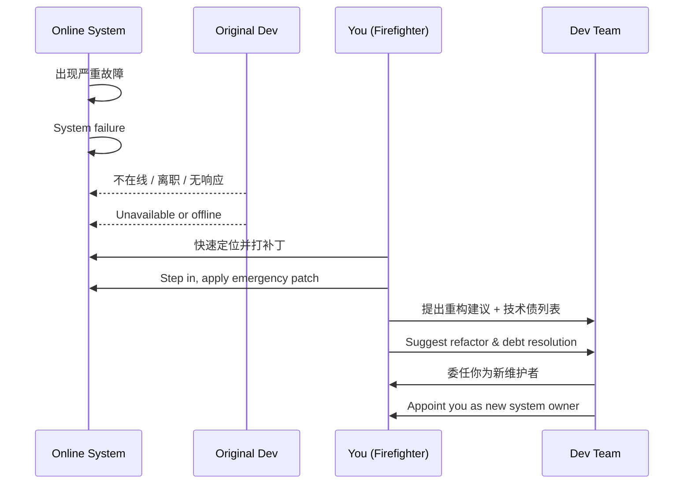

# 第五计：趁火打劫

Stratagem 05: Loot a Burning House

---

### 古文原意

Original Meaning

> 趁敌火急之时，攻其不备，掠其所需，扰其后方。
> Strike when the enemy is in chaos. Take advantage of their crisis to seize what you need or disrupt their base.

---

### 程序员解读

Programmer's Interpretation

当系统、团队或竞品处于混乱、故障、转型等“非常时期”，正是你推进方案、获取资源、扩大影响力的好时机。
When a system, team, or competitor is in crisis—due to failure, transition, or disarray—that's your opportunity to push changes, gain resources, or expand influence.

不是落井下石，而是抓住时机“趁乱上马”，让你的解决方案成为“救火英雄”。
This isn't about sabotage—it's strategic timing. Be the one with the solution when others are burning out.

---

### 实用场景

Practical Scenarios

场景一：系统宕机你来救火
Scenario 1: Fixing a System Crash for Visibility

线上服务宕机，原负责人不在，你临时排查定位 bug，提交补丁，稳定系统。事后你建议重构方案，全员支持。
A critical system crashes, and the owner is absent. You step in, locate the bug, patch it, and restore service. Later, when you propose a refactor, everyone is on board.

场景二：竞品混乱你抢市场
Scenario 2: Gaining Market Share from Competitor Chaos

对手产品频繁出现安全问题，你及时发布强化版安全报告与 demo 视频，获得技术社区与客户关注。
A competitor suffers repeated security failures. You publish a timely hardening guide and release a secure demo—earning community praise and new users.

---

### 示例代码（C#）

Example Code (C#)

```csharp
// 趁火打劫：在混乱中介入系统，提出解决方案
// Crisis patch today, long-term control tomorrow

public class HotfixPatcher
{
    public static void ApplyEmergencyPatch()
    {
        try
        {
            // 临时修复空引用问题
            Console.WriteLine("Applying emergency null check...");
            // 原始逻辑省略
        }
        catch (Exception ex)
        {
            // 快速响应机制，记录日志
            Console.WriteLine("Hotfix failed: " + ex.Message);
        }
    }
}
```

---

### Mermaid 流程图：危机干预，抢占主导

Mermaid Diagram: Crisis Response → Future Ownership



---

### 格言

Maxim

> 混乱之中，藏有新权；火光未灭，先抢先赢。
> In the smoke of chaos lies unclaimed power; while the fire burns, those who move first win.
