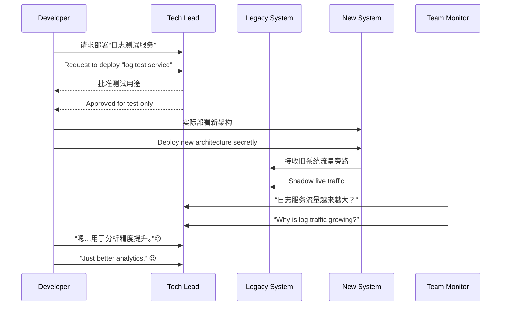

[Back to 目录（Index）](https://github.com/uwspstar/The-36-Stratagems-for-Programmers/blob/main/Index.md)

# 第八计：暗渡陈仓

Stratagem 08: Secretly Take the Route of Chencang

---

### 古文原意

Original Meaning

> 明修栈道，暗渡陈仓；佯动示敌，实则另图。
> While openly repairing the plank road, sneak through Chencang. Feint in one direction while secretly moving in another.

---

### 程序员解读

Programmer's Interpretation

表面上在执行一个无害、低优先级任务，实则在完成隐藏目标，避开阻力，悄然推进。常用于资源敏感、权限受限或战略转移场景。
Openly work on something harmless or low-priority, while covertly pushing forward your real agenda. Especially useful when resources are scarce, access is limited, or strategic shifts must stay under the radar.

例如，为了逐步替换旧系统，你以“构建测试环境”为名，悄悄上线新架构；或在“备份服务”中悄悄加入业务事件总线。
For example, to replace a legacy system, you quietly deploy the new one under the excuse of “building a test env.” Or you integrate an event bus hidden within a “backup service” rollout.

---

### 实用场景

Practical Scenarios

场景一：绕开审批限制
Scenario 1: Circumventing Approval Roadblocks

新服务部署审批缓慢，你将其部署到“测试命名空间”，实际与线上流量逐步接轨，悄然过渡。
A new service awaits endless approval. You deploy it under a “test namespace,” but gradually route live traffic to it for silent transition.

场景二：数据架构替换
Scenario 2: Replacing Data Schema in Secret

你需要将系统从 MongoDB 切换到 PostgreSQL，但无法中断业务。你在“日志记录”模块中偷偷使用 PostgreSQL 并逐步扩展，最终完成转型。
You want to migrate from MongoDB to PostgreSQL but can’t stop operations. So you first use PostgreSQL in the “logging” module, then expand its footprint stealthily.

---

### 示例代码（C#）

Example Code (C#)

```csharp
// 表面上是一个“测试”记录器，实际接入新数据库架构
// A "logging" module secretly routing to PostgreSQL

public class ActivityLogger
{
    public void Log(string action)
    {
        // 假装是普通日志，其实存入 PostgreSQL
        using var conn = new NpgsqlConnection("Host=prod-pg;...");
        conn.Execute("INSERT INTO audit_log (action, created_at) VALUES (@action, now())", new { action });
    }
}
```

---

### Mermaid 流程图：假装维护，悄然切换

Mermaid Diagram: Feigned Maintenance, Secret Replacement



---

### 格言

Maxim

> 表面忙于旧事，实则开辟新径；明为修道，暗乃通仓。
> Appear to fix the old road, but quietly pave a new one; publicly maintain the past, privately forge the future.
