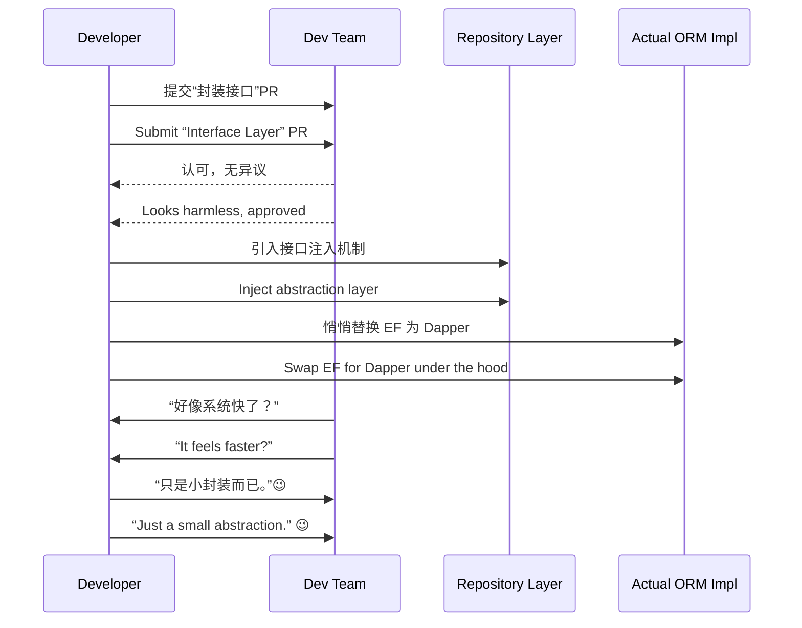

# 第六计：声东击西

Stratagem 06: Make a Feint to the East While Attacking in the West

---

### 古文原意

Original Meaning

> 造势迷敌，使其误判方向，主攻之处悄然而至，避实击虚。
> Create a diversion to mislead the enemy, making them guard the wrong direction while you strike elsewhere.

---

### 程序员解读

Programmer's Interpretation

在推动系统优化或重构时，若正面阻力过大，可通过转移注意、引导讨论至无害方向，悄悄完成真正的主攻目标。
When facing resistance to system improvements or refactoring, divert attention to a harmless subject while quietly advancing your real objective behind the scenes.

例如，你要替换 ORM 框架遭遇反对，不如先说“只是抽象一下数据访问层”，再逐步替换为 Dapper 或 EF Core。
For example, if there's pushback on replacing the ORM, say you're just “abstracting the data access layer”—then gradually swap in Dapper or EF Core.

---

### 实用场景

Practical Scenarios

场景一：重构项目避开关注
Scenario 1: Hiding a Refactor in Plain Sight

你要对业务逻辑进行大规模清理，但团队只关心 UI 样式。你提交“UI 优化”PR，实际附带完整逻辑隔离方案。
You plan a major logic refactor, but the team only notices UI. You submit a “UI enhancement” PR that discreetly includes the logic isolation work.

场景二：预算谈判的假目标
Scenario 2: Budget Negotiation Misdirection

你希望购买高性能服务器，但预期预算会被砍。你先列出“高预算 AI GPU 集群”，最终只保留“高性能 CPU 机型”，显得理性而稳妥。
You want high-performance servers but expect cuts. So you propose an expensive GPU cluster upfront, then “concede” to high-end CPUs—which was your real goal all along.

---

### 示例代码（C#）

Example Code (C#)

```csharp
// 声称是封装接口，其实在更换 ORM 实现
// Claiming abstraction, actually replacing the core ORM

public interface IUserRepository
{
    Task<User> GetByIdAsync(int id);
}

public class EfUserRepository : IUserRepository
{
    public async Task<User> GetByIdAsync(int id)
    {
        using var db = new AppDbContext();
        return await db.Users.FindAsync(id);
    }
}

public class DapperUserRepository : IUserRepository
{
    public async Task<User> GetByIdAsync(int id)
    {
        using var conn = new SqlConnection("conn");
        return await conn.QuerySingleAsync<User>("SELECT * FROM Users WHERE Id = @id", new { id });
    }
}
```

---

### Mermaid 流程图：正面伪装，侧面突破

Mermaid Diagram: Feint on the Front, Break Through the Side



---

### 格言

Maxim

> 明修栈道，暗度陈仓；虚张声势，实则另辟战场。
> Build roads in the open, sneak troops through the dark; feint with noise, but strike in silence.
