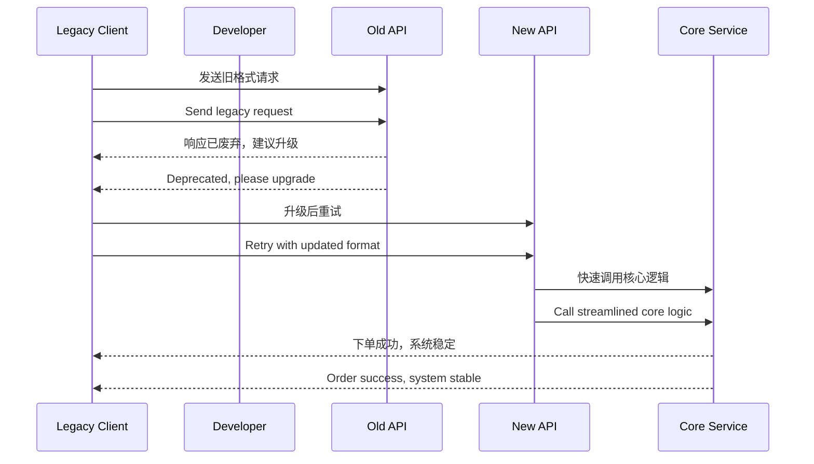

# 第十一计：李代桃僵

Stratagem 11: Sacrifice the Plum Tree to Save the Peach Tree

---

### 古文原意

Original Meaning

> 舍小保大，牺牲次要以保全关键；以损换存，以退为进。
> Sacrifice something lesser to protect something greater. Give up the unimportant to preserve the essential.

---

### 程序员解读

Programmer's Interpretation

在系统设计、项目管理或架构演进中，面对无法两全的局面，主动放弃部分模块、功能或兼容性，以换取系统整体的稳定与核心目标的实现。
In system design or project planning, when trade-offs are unavoidable, proactively sacrifice non-critical modules, features, or compatibility to safeguard system integrity and achieve long-term goals.

例如，为提高系统性能，舍弃兼容老旧 API；为确保上线进度，放弃不成熟的附加功能，集中交付核心模块。
For instance, drop support for legacy APIs to improve performance, or cut unfinished features to ensure a timely launch of the core system.

---

### 实用场景

Practical Scenarios

场景一：重构中放弃兼容层
Scenario 1: Dropping Compatibility During Refactor

你在重构服务时，不再支持某些旧客户端请求格式，而是要求调用方升级版本，从而简化逻辑、提高效率。
During refactoring, you stop supporting legacy request formats and require clients to upgrade, simplifying your logic and improving maintainability.

场景二：产品交付优先级调整
Scenario 2: Adjusting Product Delivery Priorities

项目时间紧张，你主动裁剪 UI 动效与次要功能，优先保障核心流程上线。
With tight deadlines, you cut UI animations and minor features to ensure the core workflow is delivered on time.

---

### 示例代码（C#）

Example Code (C#)

```csharp
// 李代桃僵：牺牲兼容层，保主流程
// Drop legacy support for simplicity and speed

[ApiController]
[Route("api/v2/orders")]
public class OrdersV2Controller : ControllerBase
{
    [HttpPost]
    public IActionResult Create(OrderDto order)
    {
        // 不再兼容 v1 老格式，简化流程
        if (order == null || order.Items.Count == 0)
            return BadRequest("Invalid order");

        // 核心流程保留，服务更稳更快
        ProcessOrder(order);
        return Ok("Order created");
    }
}
```

---

### Mermaid 流程图：弃枝护干，主次分明

Mermaid Diagram: Sacrifice the Branch to Save the Trunk



---

### 格言

Maxim

> 舍枝以护干，弃末以守本；宁伤小果，勿毁主根。
> Let go of the branch to save the trunk; sacrifice the fringe to protect the root.
