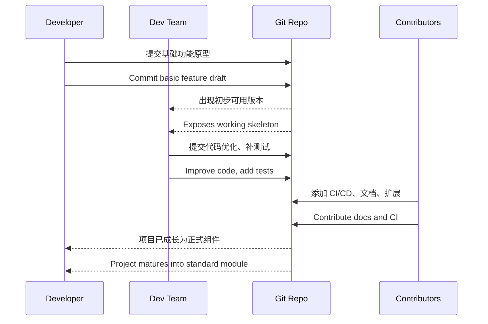

# 第十七计：抛砖引玉

Stratagem 17: Toss Out a Brick to Attract Jade

---

### 古文原意

Original Meaning

> 以小利诱人，以虚激实；先献其“砖”，引出对方之“玉”。
> Offer something of little value to elicit something more precious from others. Give small to gain big.

---

### 程序员解读

Programmer's Interpretation

在技术协作、开源建设、团队沟通中，先主动贡献一个初步的想法、原型或工具，激发他人的兴趣与补充，从而引出更强、更完善的成果。
In collaboration, open source, or team discussions, share an initial idea, prototype, or tool—even if incomplete—to spark others’ input. Your small offering may attract more polished contributions.

例如，你提交一个简易工具 PR，引发团队讨论和改进热潮；或发布半成品开源项目，吸引他人优化完善。
For example, submit a basic internal tool and trigger valuable feedback; or launch a minimal open-source repo and let the community enhance it.

---

### 实用场景

场景一：用原型引导设计共识
Scenario 1: Prototype to Align Design Direction

团队对 UI/UX 没有统一意见，你用 Figma 草图抛出一个简单方案，结果设计师纷纷补充、团队迅速达成共识。
The team disagrees on UI/UX. You create a quick Figma draft. Designers add on, and consensus is quickly reached.

场景二：低成本工具催生团队贡献
Scenario 2: Internal Tool Sparks Collaboration

你用一天写了个 API Mock 工具，结果组内同事自发帮你完善验证逻辑、部署脚本，最终成为项目标配。
You build an API mocking tool in one day. Teammates start contributing improvements, turning it into an essential tool.

---

### 示例代码（C#）

Example Code (C#)

```csharp
// 抛砖引玉：先交一个简单版本，引导他人优化
// Publish a basic idea to attract better ones

public static class SimpleHealthCheck
{
    public static IApplicationBuilder UseBasicHealthEndpoint(this IApplicationBuilder app)
    {
        app.Map("/health", builder =>
        {
            builder.Run(async context =>
            {
                await context.Response.WriteAsync("OK");
            });
        });
        return app;
    }
}
```

---

### Mermaid 流程图：以“砖”启思，引“玉”成器

Mermaid Diagram: Brick First, Jade Follows



---

### 格言

Maxim

> 先出一砖，不求完美；引人入局，共炼美玉。
> Offer a rough brick, not perfection; invite others to polish it into jade.
