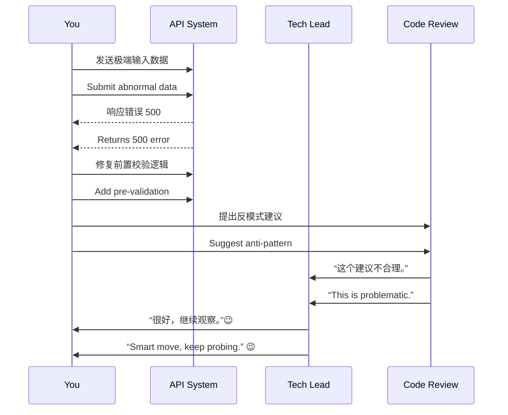

[Back to 目录（Index）](https://github.com/uwspstar/The-36-Stratagems-for-Programmers/blob/main/Index.md)

# 第十三计：打草惊蛇

Stratagem 13: Beat the Grass to Startle the Snake

---

### 古文原意

Original Meaning

> 有意试探，以动制静，察敌动向，探其虚实。
> Stir the grass to scare the snake—test the waters deliberately, reveal hidden threats, and assess the true situation.

---

### 程序员解读

Programmer's Interpretation

在面对不确定风险、隐性故障或不清晰边界的系统时，主动“试一试”，故意引发反应，用来探查潜在问题或测试团队态度。
When dealing with ambiguous risks, hidden bugs, or unclear system boundaries, intentionally “poke” the system or process to reveal hidden issues or stakeholder positions.

例如，在重要上线前提前构造边界测试用例，观察系统反应；或在会议中故意提出边缘问题，试探领导或同事真实立场。
For instance, before launch, run aggressive edge-case tests to gauge stability. Or raise a controversial topic in a meeting to sense people's true thinking.

---

### 实用场景

Practical Scenarios

场景一：上线前的稳定性测试
Scenario 1: Poke Before Production

你在系统正式发布前，故意提交边界输入或模拟超载请求，观察是否触发异常，以免上线后“真蛇咬人”。
Before release, you submit edge-case data or simulate overloads to provoke failures now—before they strike in production.

场景二：评审会中的提问试探
Scenario 2: Strategic Questions in Code Review

你在审查某组件时，故意提出“不合理”建议，观察开发者反应，从而判断其是否真正理解架构原理。
In code review, you propose a flawed approach on purpose to see if the author pushes back—revealing their level of understanding.

---

### 示例代码（C#）

Example Code (C#)

```csharp
// 打草惊蛇：测试系统是否能应对异常输入
// Inject weird input to trigger hidden bugs

public class TestDataInjector
{
    public static void Run()
    {
        var input = new string('🧨', 10000); // 超大 emoji 字符串
        var api = new HttpClient();

        var result = api.PostAsync("https://api.myapp.com/comments", 
            new StringContent(JsonSerializer.Serialize(new { content = input })));

        Console.WriteLine("Response: " + result.Result.StatusCode);
    }
}
```

---

### Mermaid 流程图：试探系统/人心反应

Mermaid Diagram: Trigger Reactions to Reveal Truths



---

### 格言

Maxim

> 不惊不显，不试不明；蛇未现身，草先动之。
> Without disturbance, danger stays hidden; to know the snake, stir the grass first.
