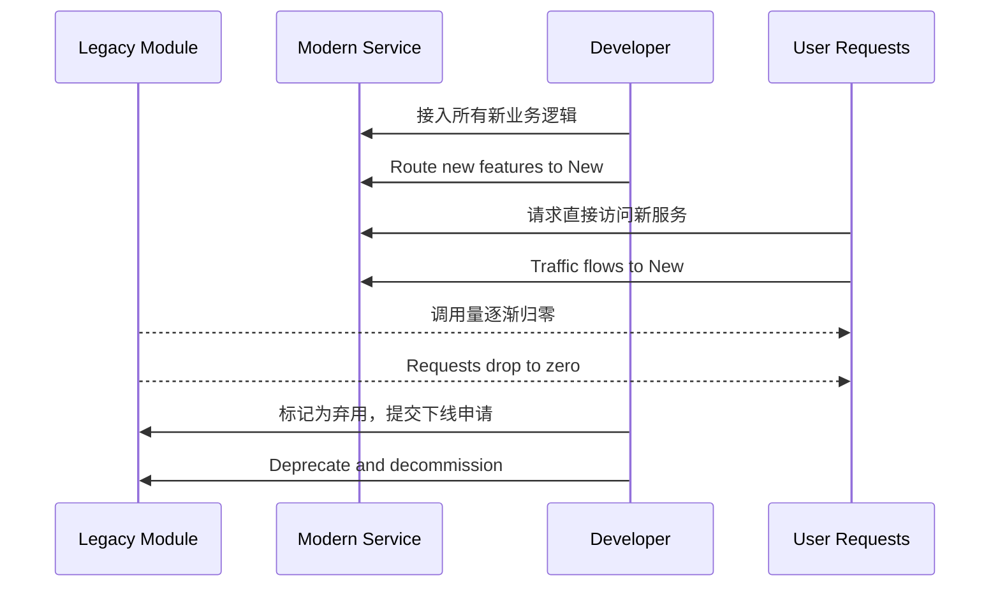

# 第十九计：釜底抽薪

Stratagem 19: Remove the Firewood from Under the Pot

---

### 古文原意

Original Meaning

> 不正面交锋，而是从根本上切断其支撑，使敌方自乱阵脚、瓦解势力。
> Instead of confronting head-on, remove the source of power and support—let the enemy collapse by itself.

---

### 程序员解读

Programmer's Interpretation

在面对不合理架构、顽固技术债、或人事控制时，避免正面冲突，而是绕道切断其“依赖根基”，使其自然失去影响力或存在意义，从而推动系统转型。
When confronting entrenched technical debt, legacy systems, or power structures, don’t attack directly. Instead, cut off the dependencies that keep them relevant—letting them fade naturally.

例如，不争辩旧模块有多糟，而是逐步将所有新功能迁出，最后让它因“无调用”而自动下线。
For instance, instead of arguing against a legacy module, quietly redirect all new features elsewhere. Eventually, the unused module retires itself.

---

### 实用场景

场景一：逐步废弃旧系统
Scenario 1: Retiring Legacy System by Starvation

你不直接废除旧报表服务，而是让所有新业务接入 BI 平台，逐渐断绝旧系统调用流量，最终自然关停。
You don’t forcibly deprecate the old reporting tool. Instead, you direct all new reports to a BI platform. Traffic to the legacy tool fades, justifying its shutdown.

场景二：切断非协作模块的依赖
Scenario 2: Cut Support for Uncooperative Code Owners

某模块由另一个部门维护且拒不配合。你主动将该功能重写并独立部署，使原模块无人再依赖，自行边缘化。
A module owned by another team is uncooperative. You rebuild the feature independently, remove all dependencies, and let the old module fall into disuse.

---

### 示例代码（C#）

Example Code (C#)

```csharp
// 釜底抽薪：不是直接删除旧模块，而是让它“失去燃料”
// Let legacy code become irrelevant by removing all use

public interface IReportService
{
    Task<string> GenerateAsync(ReportRequest request);
}

// 新服务替代旧模块，不再调用 LegacyReport
public class ModernReportService : IReportService
{
    public Task<string> GenerateAsync(ReportRequest request)
    {
        // 接入现代 BI 平台
        return BIPlatform.GenerateReportAsync(request);
    }
}
```

---

### Mermaid 流程图：截断根基，不战而退

Mermaid Diagram: Cut Off Support, Let the System Collapse



---

### 格言

Maxim

> 火不自熄，薪尽则止；避其锋芒，断其根本。
> The fire won’t die by force, but will fade when wood runs dry; avoid the blade—cut the root.
