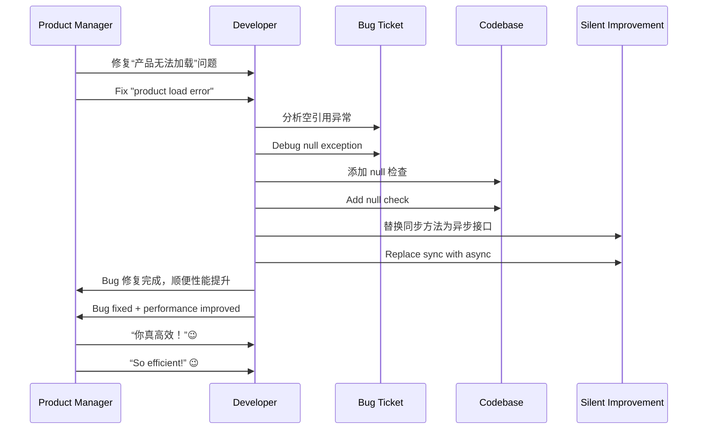

# 第十二计：顺手牵羊

Stratagem 12: Take the Opportunity to Steal a Goat

---

### 古文原意

Original Meaning

> 趁机取利，于无防之处顺势而取；不费一兵，得一成果。
> Take advantage of a loosely guarded situation. Gain benefit without direct confrontation or effort.

---

### 程序员解读

Programmer's Interpretation

在系统迭代、技术栈更新、代码改动过程中，顺势“捎带”推进自己的优化目标，让改进在无阻力中自然发生。
During version upgrades, refactors, or routine deployments, subtly introduce your own improvements alongside other changes—so enhancements happen without resistance.

例如，借着上线新功能的机会顺带重构了服务结构，或在修 bug 时顺手清理了技术债。
For example, while deploying a new feature, you also refactor the service layout. Or when fixing a bug, you quietly eliminate some tech debt.

---

### 实用场景

Practical Scenarios

场景一：升级中“偷渡”重构
Scenario 1: Refactor Hidden in a Version Upgrade

你在升级框架版本（如 .NET 6 → 8）时顺手重命名服务、调整目录结构并清理无用代码，没人反对，效果显著。
During a .NET version upgrade, you quietly rename services, reorganize folders, and remove dead code. No one objects, and quality improves.

场景二：修 bug 时优化结构
Scenario 2: Fix Bug, Improve Design

修复某个空引用异常时，你顺手将数据层的接口异步化，提高整体性能。
While fixing a null reference bug, you update the data layer to use async methods—resulting in better performance.

---

### 示例代码（C#）

Example Code (C#)

```csharp
// 顺手牵羊：修复 bug 的同时进行优化
// Fix bug, and sneak in async performance boost

public class ProductService
{
    private readonly IProductRepository _repo;

    public ProductService(IProductRepository repo)
    {
        _repo = repo;
    }

    public async Task<Product> GetByIdAsync(int id)
    {
        // 原本是同步方法导致阻塞
        // 修复 bug 同时优化性能
        return await _repo.FindAsync(id);
    }
}
```

---

### Mermaid 流程图：本为修补，顺带优化

Mermaid Diagram: A Fix That Smuggles an Improvement



---

### 格言

Maxim

> 顺水行舟，借势而动；人不察觉，功已在手。
> Sail with the current, move with the flow; before others notice, your work is done.
