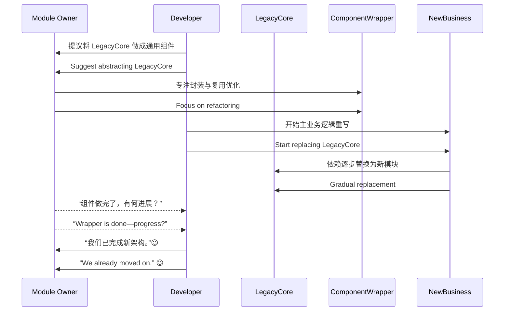

[Back to 目录（Index）](https://github.com/uwspstar/The-36-Stratagems-for-Programmers/blob/main/Index.md)

# 第十五计：调虎离山

Stratagem 15: Lure the Tiger Out of the Mountain

---

### 古文原意

Original Meaning

> 引诱强敌离开有利地形，脱离其依靠之势，再予以打击。
> Entice the strong enemy away from their advantageous position, separate them from their support, then strike.

---

### 程序员解读

Programmer's Interpretation

当某个系统、模块或人员长时间占据关键资源、主导权或技术话语权时，正面交锋难以取胜，不如引其“离山”——通过引导其投入他事或转移战场，从而间接取得控制权。
If a team, module, or architect holds too much power or control, direct confrontation often fails. Instead, guide them away—into a side task, external focus, or promotion—then quietly regain control of the core.

---

### 实用场景

Practical Scenarios

场景一：解耦主模块控制权
Scenario 1: Detaching a Controlling Module

旧系统中的某个“核心库”由一位工程师强力控制、难以修改。你提出将该库抽离为“通用组件”，对方欣然专注封装细节，你则在主业务线中逐步替换其依赖。
A “core library” is tightly controlled by one engineer. You propose turning it into a reusable component. While they focus on generalizing it, you gradually replace it in the main business logic.

场景二：架构师调岗腾出空间
Scenario 2: Create Space Through Role Shift

某位技术主管否定你提出的新架构方案。你主动推荐其参与公司级架构组，让其关注“全局战略”，自己则在小组中推动微服务落地。
A senior architect blocks your proposal. You suggest they join a company-wide architecture board. While they focus on broader strategy, you implement your plan at the team level.

---

### 示例代码（C#）

Example Code (C#)

```csharp
// 调虎离山：将复杂模块封装转移，让主业务线实现替代
// Wrap the tiger, then quietly bypass it

public interface IEmailSender
{
    Task SendAsync(string to, string subject, string body);
}

// 老模块控制者主导实现
public class LegacySmtpSender : IEmailSender
{
    public Task SendAsync(string to, string subject, string body)
    {
        // 原始实现
        return SmtpClient.Send(to, subject, body);
    }
}

// 你悄悄实现新方案
public class QueueBasedEmailSender : IEmailSender
{
    public Task SendAsync(string to, string subject, string body)
    {
        // 新方案通过消息队列异步发送
        return EmailQueue.Enqueue(to, subject, body);
    }
}
```

---

### Mermaid 流程图：引开掌控者，转向重构

Mermaid Diagram: Divert the Gatekeeper, Rebuild in Peace



---

### 格言

Maxim

> 虎居山林，不可轻敌；引其离位，方能制胜。
> A tiger on its mountain is untouchable—lure it out to win the ground it guards.
