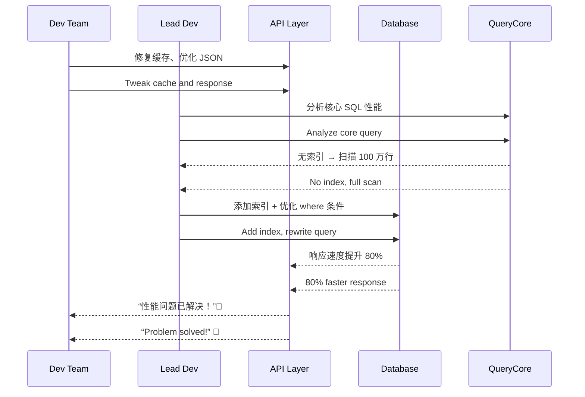

[Back to 目录（Index）](https://github.com/uwspstar/The-36-Stratagems-for-Programmers/blob/main/Index.md)

# 第十八计：擒贼擒王

Stratagem 18: Capture the Thief First to Capture the King

---

### 古文原意

Original Meaning

> 要破敌之势，先擒其主；直击核心，一举制胜。
> To break the enemy's formation, capture the leader first; strike at the core for swift victory.

---

### 程序员解读

Programmer's Interpretation

在解决复杂问题、推动系统变革或优化流程时，不要从边缘小问题入手，而应精准识别并解决“核心瓶颈”——那个一旦突破，全局即可松动的关键点。
When facing a complex system or team challenge, don’t start from the edges. Instead, identify and eliminate the core blocker—the one that, once removed, unblocks the entire system.

例如，发现性能瓶颈在数据库连接池，而不是业务代码；或推动团队进步，先说服影响力最大的工程师。
For example, find that performance issues stem from DB connection pooling, not application logic. Or persuade the most influential engineer to unlock broader team adoption.

---

### 实用场景

场景一：攻克系统性能瓶颈
Scenario 1: Attack the Real Performance Bottleneck

系统响应慢，许多人在调 UI 和 API。你发现问题根源在 SQL Server 的查询未加索引，精准优化后整体提速。
The system is slow, and everyone tweaks UI or APIs. You trace it to an unindexed SQL query. Once fixed, performance dramatically improves.

场景二：说服关键人物促成技术方案
Scenario 2: Convince the Influencer, Win the Team

你的新架构方案被冷处理，你单独和资深工程师沟通取得认同，他一发言，整个团队立刻支持转向。
Your new architecture idea is ignored. You talk privately with a senior dev who supports it. Once they speak up, the whole team agrees.

---

### 示例代码（C#）

Example Code (C#)

```csharp
// 擒贼擒王：不优化外围代码，直击性能瓶颈 SQL
// Ignore symptoms, go after the root query

public class OrderRepository
{
    private readonly IDbConnection _conn;

    public async Task<IEnumerable<Order>> GetSlowOrdersAsync()
    {
        // 原查询未加索引字段
        var sql = "SELECT * FROM Orders WHERE Status = 'Pending'";
        // 解决方式：添加索引 + 改写分页逻辑
        return await _conn.QueryAsync<Order>(sql);
    }
}
```

---

### Mermaid 流程图：直击核心，牵一发而动全局

Mermaid Diagram: Strike the Core, Unblock the Whole



---

### 格言

Maxim

> 不打草驯蛇，专擒王夺势；锁定核心，一击致胜。
> Don’t scare the snakes—seize the king. Strike at the core, and the battle is won.
