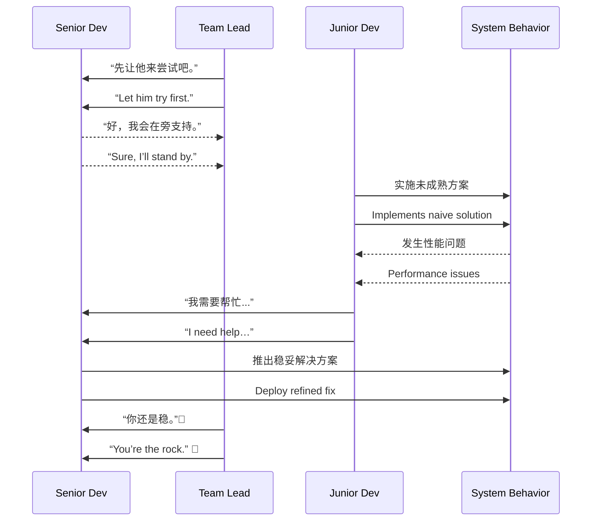

# 第十六计：欲擒故纵

Stratagem 16: Let the Enemy Go to Catch Them Later

---

### 古文原意

Original Meaning

> 逼之则走，松之则纵；放而后收，动中制胜。
> Press too hard and the prey flees; let them go temporarily to set the trap. Yield first to capture later.

---

### 程序员解读

Programmer's Interpretation

在技术推进、人际协作、系统治理中，有时不宜直接压制或立刻控制，而应暂时“放手”，引导对方走到极限、自暴其短，反而为你后续掌控创造条件。
In tech leadership or system design, immediate control or confrontation may backfire. Sometimes it’s wiser to yield temporarily—let others hit a wall—so you can step in later with clarity and authority.

例如，你建议架构优化遭拒，不妨让对方先试原方案，当出现性能瓶颈时你再提出改良版本，顺势接管主导权。
For example, your refactor proposal is rejected. Let the current approach run its course. When it fails, you present your solution—and take the lead.

---

### 实用场景

Practical Scenarios

场景一：让方案自行暴露问题
Scenario 1: Let the Flawed Design Fail First

团队坚持用未验证的新框架。你表示支持，并提醒关键风险。结果项目中途出现瓶颈，大家自然转向你原先的建议。
The team insists on using an untested new framework. You support it while quietly noting key risks. When issues arise mid-project, they turn to your original idea.

场景二：新人接手代码后出问题
Scenario 2: Newcomer Takes Over, Then Needs Help

你原本负责核心模块。新人接手后你不过度干预。当 TA 陷入 bug 泥潭、请求支援时，你提供精准指导，顺势赢得团队信任。
You hand over a key module to a newcomer and avoid micromanaging. When problems arise and help is needed, you step in, regaining trust and technical authority.

---

### 示例代码（C#）

Example Code (C#)

```csharp
// 欲擒故纵：暂不介入，让问题显现，再给出优化方案
// Let go, let the issue happen, then step in with solution

public class NaiveCache
{
    private readonly Dictionary<string, string> _cache = new();

    public void Add(string key, string value)
    {
        // 无过期策略、无并发控制
        _cache[key] = value;
    }

    public string Get(string key) => _cache.ContainsKey(key) ? _cache[key] : null;
}

// 后续你引入更优方案
public class LruCache : ICache
{
    // 支持容量限制、线程安全、自动淘汰
    // ...
}
```

---

### Mermaid 流程图：放手即是掌控之机

Mermaid Diagram: Yield First, Control Later



---

### 格言

Maxim

> 一纵一擒，先放后控；明退暗进，胜在转机。
> Release to restrain, retreat to advance; control lies in timing the turn.
