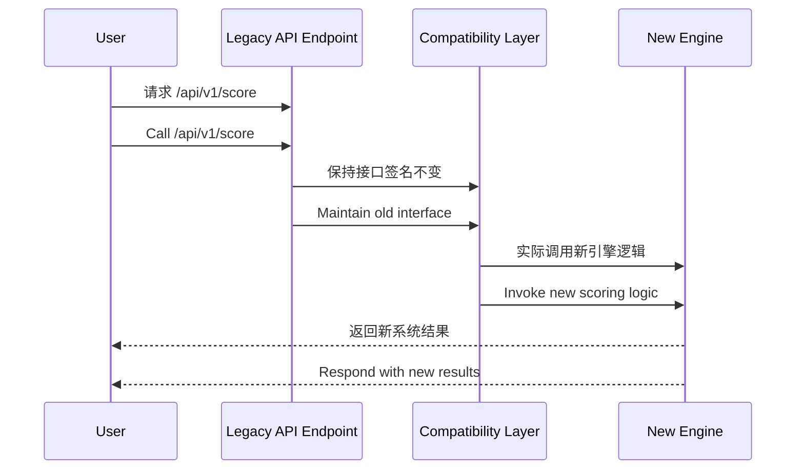

[Back to 目录（Index）](https://github.com/uwspstar/The-36-Stratagems-for-Programmers/blob/main/Index.md)

# 第十四计：借尸还魂

Stratagem 14: Borrow a Corpse to Resurrect the Soul

---

### 古文原意

Original Meaning

> 借用旧名义、旧形式、旧制度，使之焕发新生命；以旧载新，形存神变。
> Revive the spirit by borrowing a corpse—use a dead form, name, or structure to carry new meaning or strategy.

---

### 程序员解读

Programmer's Interpretation

在推动新项目、新思想、新系统时，披上“旧系统”的外衣或沿用旧名义，以降低阻力、提升接受度，实现“借壳上线”“以旧带新”。
When pushing a new idea, project, or system, present it under the guise of an old name or legacy wrapper—reducing resistance and easing adoption. A “reborn” innovation.

例如，你想上线全新规则引擎，但运维不支持新模块部署，于是你将其封装进“原有风控系统”中上线。
For instance, you want to launch a new rules engine, but ops won’t approve a new module—so you bundle it into the existing “risk control system” and ship it.

---

### 实用场景

Practical Scenarios

场景一：重构旧功能之名
Scenario 1: Refactor with a Familiar Label

你将“数据同步模块”完全重写为事件驱动异步结构，但上线时依旧命名为“SyncService”，无人抗拒。
You completely rebuild “data sync” as an async event-driven system—but name it “SyncService” to maintain continuity and avoid opposition.

场景二：复用已知入口布新系统
Scenario 2: Launch New System Under Legacy Entry Point

你上线一个全新的 Dashboard，用旧系统的路径 `/admin` 做入口，用户无需培训即可过渡。
You roll out a new admin dashboard but route it through the familiar `/admin` URL. Users seamlessly adopt it without confusion.

---

### 示例代码（C#）

Example Code (C#)

```csharp
// 借“旧接口”之名，托新逻辑之魂
// Wrap a new engine in a legacy route

[ApiController]
[Route("api/v1/score")]
public class RiskScoreController : ControllerBase
{
    private readonly INewScoringEngine _engine;

    public RiskScoreController(INewScoringEngine engine)
    {
        _engine = engine;
    }

    [HttpPost]
    public IActionResult GetScore([FromBody] UserProfile profile)
    {
        // 实际调用全新评分引擎
        var score = _engine.Calculate(profile);
        return Ok(new { Score = score });
    }
}
```

---

### Mermaid 流程图：借旧形而启新魂

Mermaid Diagram: Old Shell, New Spirit



---

### 格言

Maxim

> 形虽旧，神已换；借古皮，焕新魂。
> The form remains, but the soul is reborn; beneath the shell of the old, the future breathes anew.
