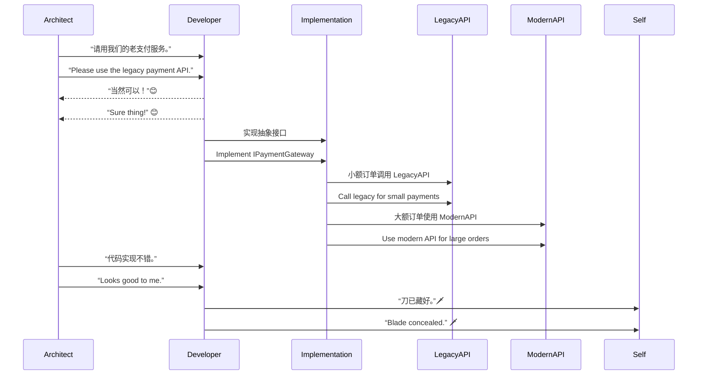

[Back to 目录（Index）](https://github.com/uwspstar/The-36-Stratagems-for-Programmers/blob/main/Index.md)

# 第十计：笑里藏刀

Stratagem 10: Hide a Dagger Behind a Smile

---

### 古文原意

Original Meaning

> 表面和善，实则暗藏杀机；伪装合作，伺机反击。
> Smile on the outside while concealing your blade. Mask your hostility with politeness until the time is right to strike.

---

### 程序员解读

Programmer's Interpretation

在技术会议、代码评审、跨部门沟通中，不必正面交锋或争吵。不妨以“赞同”的态度表面配合，在实际执行中保留主导权，或通过代码“埋刀”以守技术底线。
In tech reviews, planning meetings, or cross-team discussions, you don’t need to confront openly. Express agreement on the surface while preserving control in execution—or “hide your blade” in the code to safeguard architecture.

例如，面对强加的低效方案，你口头同意但实现中加入抽象层，为后续替换留口子。
For instance, when forced to accept an inefficient design, you agree verbally but implement an abstraction layer, leaving room for future replacement.

---

### 实用场景

Practical Scenarios

场景一：会议表态，执行自控
Scenario 1: Agree in Meetings, Retain Technical Control

你在架构讨论中对某提议表示支持，实际代码中构建了接口封装，方便后期替换或版本切换。
In a meeting, you nod to the chosen solution, but in code, you build it behind interfaces to allow easy replacement later.

场景二：隐藏监控埋点
Scenario 2: Secretly Adding Monitoring to Legacy Code

面对混乱的旧代码库，你未强制重构，而是悄悄埋下日志与告警逻辑，一旦出问题便可迅速切入接管。
You don't force refactoring in a messy legacy system, but silently embed logs and alerts—so when things fail, you’re ready to step in and take charge.

---

### 示例代码（C#）

Example Code (C#)

```csharp
// 表面采用指定方案，实际保留切换控制权
// “I agree with your API” 😉 but I keep my switch...

public interface IPaymentGateway
{
    Task<bool> ProcessAsync(Order order);
}

public class HybridPaymentService : IPaymentGateway
{
    public async Task<bool> ProcessAsync(Order order)
    {
        if (order.Total < 100)
        {
            // 表面调用 LegacyAPI
            return await LegacyAPI.Pay(order);
        }
        else
        {
            // 暗藏切换逻辑，走新版接口
            return await ModernAPI.Pay(order);
        }
    }
}
```

---

### Mermaid 流程图：笑面迎人，逻辑控局

Mermaid Diagram: Smiling Outside, Controlling Within



---

### 格言

Maxim

> 面带春风，手藏利刃；言辞和气，代码护身。
> Speak with warmth, code with caution; smile wide, but guard the core with a blade unseen.
