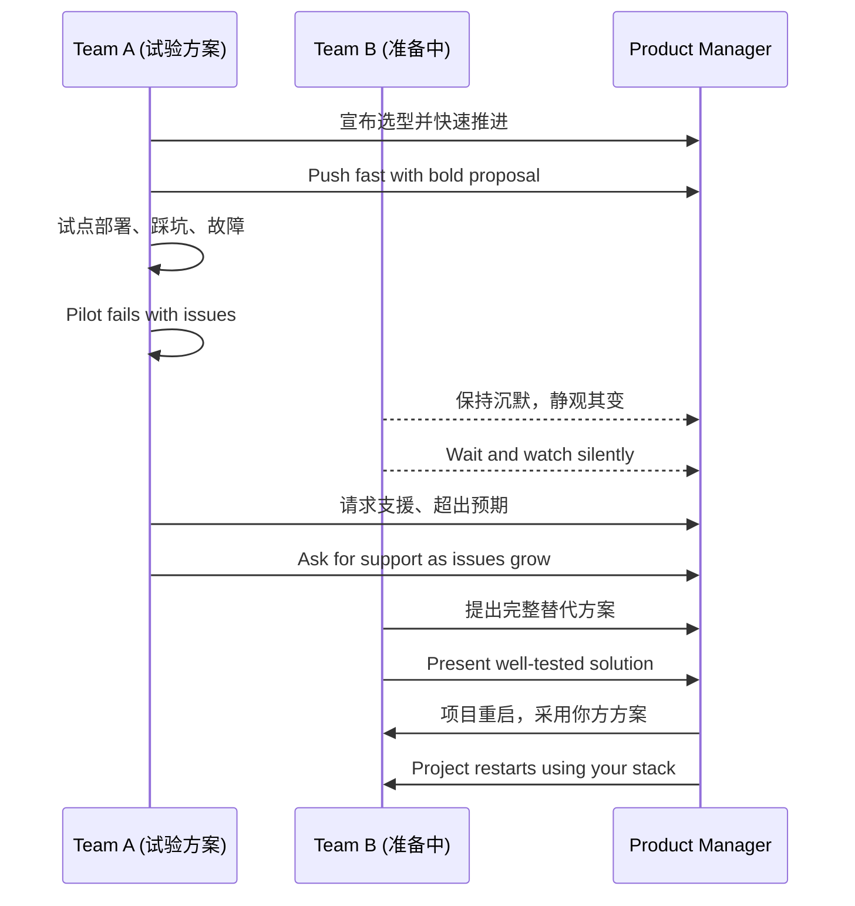

[Back to 目录（Index）](https://github.com/uwspstar/The-36-Stratagems-for-Programmers/blob/main/Index.md)

# 第四计：以逸待劳

Stratagem 04: Wait at Leisure for the Exhausted Enemy

---

### 古文原意

Original Meaning

> 敌劳我逸，以静制动，蓄力而发，专待其疲。
> Let the enemy tire themselves while you remain rested. Use stillness to control movement, and strike only when they are weary.

---

### 程序员解读

Programmer's Interpretation

面对高强度项目、技术争议或跨组竞争，不急于抢先出招，而是做好准备，观察对方疲态，在其混乱或失败后出手，一击即中。
In high-pressure projects, tech debates, or team rivalries, avoid rushing in. Instead, stay prepared and wait for others to exhaust themselves—then act decisively at the right moment.

例如，在技术选型争议中，与其第一时间表态，不如等待试点失败后再提出成熟方案。
For example, during a tech stack debate, instead of jumping in early, wait for the pilot to fail—then present a well-prepared alternative.

---

### 实用场景

Practical Scenarios

场景一：框架选型争议
Scenario 1: Framework Decision Debate

产品组坚持用某个新前端框架（如 Vue3 + Pinia），你预测问题但未阻止，而是悄悄准备 React + Zustand 方案。当对方试点失败，你立即提出成熟方案获得全场采纳。
The product team insists on a flashy new front-end stack (e.g., Vue3 + Pinia). You anticipate issues but stay quiet, preparing a React + Zustand plan instead. When their pilot fails, you step in with a stable solution.

场景二：部署平台竞争
Scenario 2: Competing Deployment Strategies

团队在 Kubernetes 与传统 VM 部署方式之间拉锯，你静观其变，同时在空闲时间完成 Helm + CI 的私测，最终展示出显著效率差距。
The team is torn between Kubernetes and VM deployment. You observe quietly, meanwhile finishing a Helm + CI test setup on your own, later demonstrating its superior performance.

---

### 示例代码（C#）

Example Code (C#)

```csharp
// 以逸待劳：平时就准备好替代方案，一旦对方失败立即切换
// Prepare a stable alternative in advance, strike when the chaos begins

public interface ICacheProvider
{
    Task<string> GetAsync(string key);
}

public class RedisCache : ICacheProvider
{
    public async Task<string> GetAsync(string key)
    {
        // 实现 Redis 获取逻辑
        return await Task.FromResult("redis-value");
    }
}

public class FallbackCache : ICacheProvider
{
    public async Task<string> GetAsync(string key)
    {
        // 当第三方缓存系统崩溃时的备用方案
        return await Task.FromResult("fallback-value");
    }
}
```

---

### Mermaid 流程图：**主战场混乱，我方养精蓄锐**

Mermaid Diagram: Let Others Tire Themselves Out First



---

### 格言

Maxim

> 急中有错，静中有胜；备而不发，动则致命。
> Haste invites mistakes, stillness breeds victory; prepare without acting—strike with precision when the time comes.
